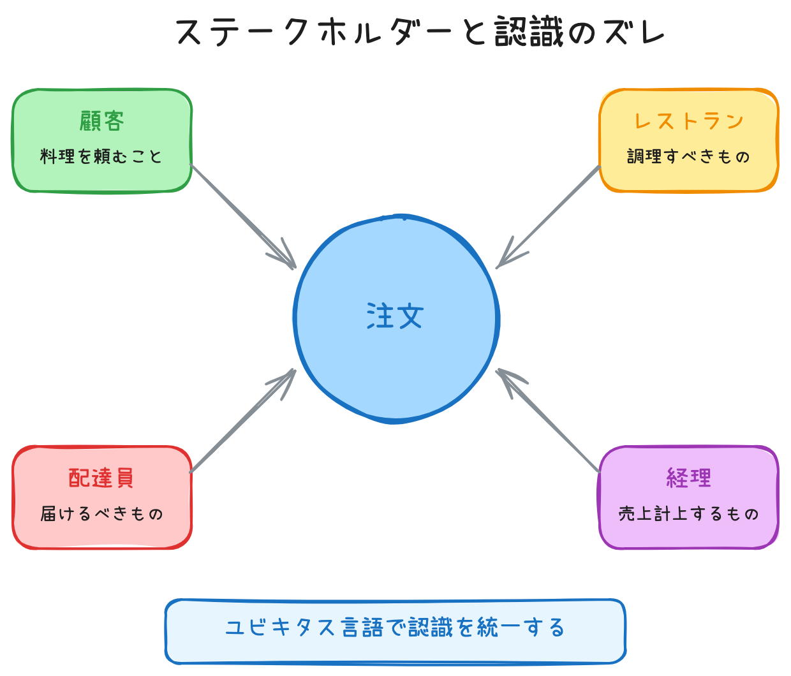

# ドメインモデリング

## 目次
1. [ステークホルダーとは？](#ステークホルダーstakeholderとは)
2. [DDDにおける重要性](#ddpにおける重要性)
3. [大切な事](#大切な事)

---

ビジネスの問題領域（ドメイン）を分析し、ソフトウェアで表現可能なモデルに落とし込む作業のこと。

**目的**:
* 全体像を把握して関心領域の可視化
* ステークホルダー間での認識を合わせる
* 複雑なビジネスロジックを整理する

---

## ステークホルダー（Stakeholder）とは？

**利害関係者**のこと。プロジェクトやシステムに関わる全ての人を指す。

### 具体例（フードデリバリーの場合）

| ステークホルダー | 役割・関心事 |
|-----------------|-------------|
| ユーザー（顧客） | 料理を注文したい、早く届いてほしい |
| レストランオーナー | 注文を受けて売上を上げたい |
| 配達員 | 効率よく配達したい、報酬を得たい |
| プロダクトオーナー | サービスを成長させたい |
| エンジニア | システムを構築・保守したい |

---

## DDDにおける重要性

異なるステークホルダーが**同じ言葉を違う意味で使う**ことがある。

### 例：「注文」という言葉

| 立場 | 「注文」の意味 |
|------|---------------|
| 顧客 | 料理を頼むこと |
| レストラン | 調理すべきもの |
| 配達員 | 届けるべきもの |
| 経理 | 売上として計上するもの |

→ これを**ユビキタス言語**で統一し、認識を合わせることがDDDの目的の一つ。

 

### イメージ

### 大切な事
#### ドメインエキスパートとの協力

> [!TIP]
> **ドメインとは？**
> 特定の業務やドメイン知識について深い理解を持つ専門家みたいな人たちのこと

