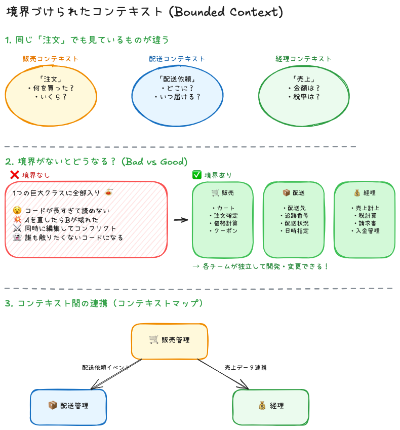

# 境界づけられたコンテキスト（Bounded Context）

## 目次
1. [コンテキストとは？](#コンテキストとは)
2. [例：「りんご」という言葉](#例りんごという言葉)
3. [システム開発での例](#システム開発での例注文という言葉)
4. [なぜ「境界」が必要なのか？](#なぜ境界が必要なのか)
5. [まとめ](#まとめ)

---

## コンテキストとは？

**「文脈」「状況」「前提」** のこと。

同じ言葉でも、話している状況によって意味が変わる。

---

## 例：「りんご」という言葉

| 状況（コンテキスト） | 「りんご」の意味 |
|:-------------------:|-----------------|
| 八百屋で | 売り物の果物 🍎 |
| 料理教室で | 食材・材料 |
| Apple Storeで | iPhone/Macのこと |
| 音楽の話で | 椎名林檎（アーティスト） |

→ **同じ「りんご」でも、文脈が違えば意味が違う！**

---

## システム開発での例：「注文」という言葉

| コンテキスト | 「注文」が意味するもの |
|:---:|----------------------|
| 🛒 販売チーム | 「誰が何を買ったか」（商品・金額・顧客） |
| 📦 配送チーム | 「どこに届けるか」（住所・日時・荷物サイズ） |
| 💰 経理チーム | 「いくら売り上げたか」（金額・税・入金状況） |

→ **それぞれ必要な情報が全然違う！**

---

## なぜ「境界」が必要なのか？

### ❌ 境界がない場合

全員が1つの「注文」クラスを使おうとする。

```
【巨大な「注文」クラス】

・顧客ID        ← 販売が追加
・商品リスト    ← 販売が追加
・配送先住所    ← 配送が追加
・追跡番号      ← 配送が追加
・税区分        ← 経理が追加
・入金日        ← 経理が追加
・...（どんどん肥大化）
```

**問題点:**
- コードが肥大化して読めない
- 配送の修正で販売が壊れる
- 全員が同じファイルを編集してコンフリクト

---

### ✅ 境界がある場合

チームごとに**別々のクラス**を作る。

```
【販売】          【配送】          【経理】
注文 {            配送依頼 {        売上 {
  顧客ID            注文ID            注文ID
  商品リスト        配送先            金額
  合計金額          追跡番号          税区分
}                 }                 }
```

**メリット:**
- 各チームが独立して開発できる
- 他チームの変更の影響を受けない
- コードがシンプルで理解しやすい

---

## まとめ

| 用語 | 意味 |
|------|------|
| **コンテキスト** | 言葉の意味が通じる範囲（文脈） |
| **境界づけられたコンテキスト** | コンテキストに明確な境界線を引くこと |

> [!TIP]
> **「この言葉、あのチームと同じ意味で使ってる？」**  
> 意味がズレてきたら、そこが境界線のサイン！

<br>



---