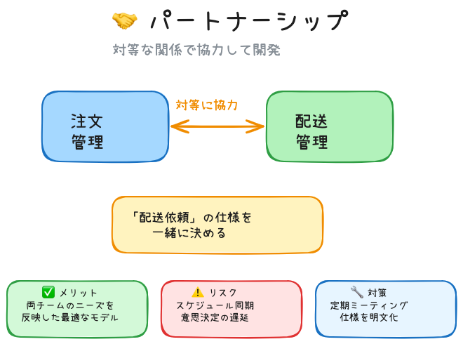
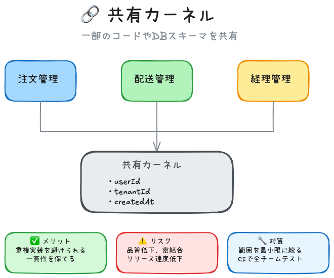
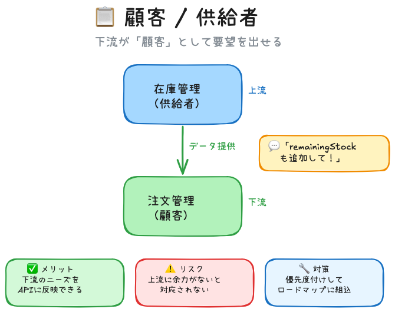
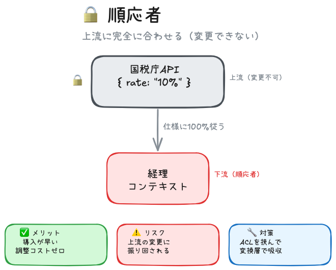
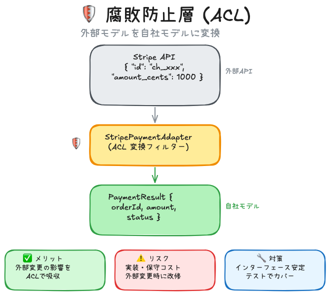
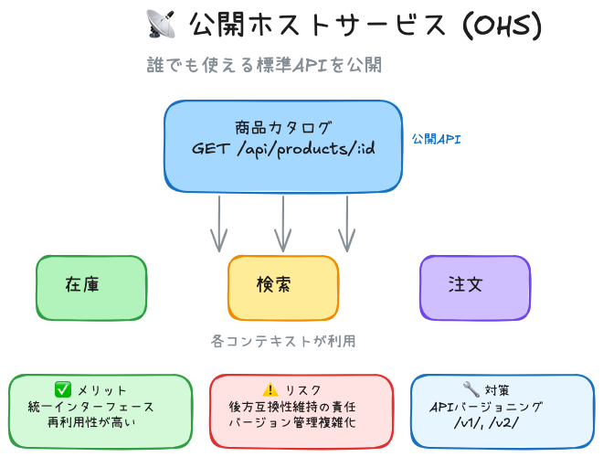

# コンテキストマップ

## 目次
1. [なぜ必要？](#なぜ必要)
2. [上流と下流の概念](#上流と下流の概念)
3. [コンテキスト連携の3つの戦略](#コンテキスト連携の3つの戦略)
4. [ECサイト全体図](#-ecサイト全体図)
5. [パターンの使い分け](#-パターンの使い分け)
6. [まとめ](#-まとめ)

---

境界づけられたコンテキスト同士の**関係性を図にしたもの**。<br>
異なるモデルを持つコンテキスト間でも連携できるシステムを構築するための基盤

---

## なぜ必要？

コンテキストを分けた後、それぞれがどう連携するかを明確にするため。

- どのチームがどのチームに依存しているか？
- データはどう流れるか？
- 誰が主導権を持っているか？

---

## 上流と下流の概念

コンテキスト間の連携では **上流（Upstream）** と **下流（Downstream）** という考え方が基本になる。

| 役割 | 説明 |
|:---:|------|
| **上流** | データを**提供する**側。変更の影響を与える |
| **下流** | データを**利用する**側。変更の影響を受ける |

### ECサイトでの例

```
    ┌───────────┐
    │  商品     │  ← 上流：商品情報を「提供」する
    │ カタログ  │
    └─────┬─────┘
          │ 商品ID, 名前, 価格
          ▼
    ┌───────────┐
    │   在庫    │  ← 中間：商品から見ると下流、注文から見ると上流
    │  管理     │
    └─────┬─────┘
          │ 在庫数
          ▼
    ┌───────────┐
    │   注文    │  ← 下流：在庫情報を「利用」する
    │  管理     │
    └───────────┘
```

> [!IMPORTANT]
> **上流が変わると、下流に影響が出る**  
> 例：「商品カタログ」で商品名の形式を変えたら、「注文管理」のコードも修正が必要になる

---

## コンテキスト連携の3つの戦略

### 🤝 戦略1：モデルの一部を共有する

**協力ベース** ― 両チームが対等に協力してモデルを作る

<br>

| パターン | 内容 |
|:--------:|------|
| **パートナーシップ** | 対等な関係で協力して開発する |
| **共有カーネル** | 一部のコードやDBスキーマを共有する |

<br>

#### パートナーシップの例



注文チームと配送チームが「配送依頼」の仕様を一緒に決める

```
  ┌────────┐                    ┌────────┐
  │  注文  │ ◄────対等に協力────► │  配送  │
  │  管理  │                      │  管理  │
  └────────┘                    └────────┘
       │                             │
       │    「配送依頼」の仕様を      │
       │      一緒に決める            │
       └─────────────────────────────┘
```

| 観点 | 内容 |
|:----:|------|
| ✅ メリット | 両チームのニーズを反映した最適なモデルが作れる |
| ⚠️ リスク | スケジュール同期の難しさ、意思決定の遅延、コミュニケーションコスト |
| 🔧 対策 | 定期的な合同ミーティング、共有ドキュメントで仕様を明文化 |

<br>

#### 共有カーネルの例



全コンテキストで共通の `userId` や `tenantId` を使う

```
  ┌────────┐    ┌────────┐    ┌────────┐
  │  注文  │    │  配送  │    │  経理  │
  │  管理  │    │  管理  │    │  管理  │
  └───┬────┘    └───┬────┘    └───┬────┘
      │            │            │
      └────────────┼────────────┘
                   ▼
        ┌───────────────────┐
        │   共有カーネル     │
        │  ・userId         │
        │  ・tenantId       │
        │  ・createdAt      │
        └───────────────────┘
```

| 観点 | 内容 |
|:----:|------|
| ✅ メリット | 重複実装を避けられる、一貫性を保てる |
| ⚠️ リスク | モデル不安定時の品質低下、コード重複、密結合、リリース速度低下 |
| 🔧 対策 | 共有範囲を **最小限** に絞る、変更時のルールを明確化、CIで全チームのテストを回す |


---

### 📋 戦略2：モデルを相手に合わせる

**顧客/供給者ベース** ― 上流と下流の力関係に基づいてどちらかが合わせる

<br>

| パターン | 内容 |
|:--------:|------|
| **顧客/供給者** | 下流が「顧客」として要望を出せる |
| **順応者** | 下流が上流に完全に合わせる（変更できない） |

<br>

#### 顧客/供給者の例



注文チームが在庫チームに「残り在庫数もAPIに追加して」と要望を出せる

```
  ┌──────────────┐
  │     在庫      │  ← 上流（供給者）
  │     管理      │
  └──────┬───────┘
         │
         │  💬「remainingStock もAPIに追加して！」
         │      ↑ 下流から要望を出せる
         ▼
  ┌──────────────┐
  │     注文      │  ← 下流（顧客）
  │     管理      │
  └──────────────┘
```

| 観点 | 内容 |
|:----:|------|
| ✅ メリット | 下流のニーズをAPIに反映できる、上流が下流を意識した設計になる |
| ⚠️ リスク | 上流に余力がないと対応されない、要望過多で上流の負担増 |
| 🔧 対策 | 要望を優先度付けして整理、上流のロードマップに組み込む形で依頼 |

<br>

#### 順応者の例



国税庁の税率APIは変更できないので、自社システムが完全に合わせる

```
  ┌──────────────────┐
  │    国税庁API      │  ← 上流（変更不可）
  │ { rate: "10%" }  │
  └────────┬─────────┘
           │
           │  仕様に100%従うしかない
           ▼
  ┌──────────────────┐
  │     経理         │  ← 下流（順応者）
  │   コンテキスト    │
  └──────────────────┘
```

| 観点 | 内容 |
|:----:|------|
| ✅ メリット | 導入が早い（合わせるだけ）、調整コストゼロ |
| ⚠️ リスク | 上流の変更に振り回される、使いにくいモデルでも使用強制 |
| 🔧 対策 | ACL（腐敗防止層）を挟んで変換層で吸収する設計に変更することを検討 |

---

### 🛡️ 戦略3：モデル間に変換層を設ける

**保護ベース** ― 独立性を保ちながら変換機構で連携する

外部システムやレガシーと連携する時に有効

<br>

| パターン | 内容 |
|:--------:|------|
| **腐敗防止層 (ACL)** | 外部モデルを自社モデルに変換 |
| **公開ホストサービス (OHS)** | 誰でも使える標準APIを公開 |
| **公開言語 (PL)** | JSON等の標準形式で通信 |

<br>

#### 腐敗防止層 (ACL) の例



Stripe APIのレスポンスを、自社の `PaymentResult` に変換する

```
  ┌──────────────────────────┐
  │       Stripe API         │  ← 外部（仕様がよく変わる）
  │ {                        │
  │   "id": "ch_xxx",        │
  │   "amount_cents": 1000,  │
  │   "currency": "jpy"      │
  │ }                        │
  └────────────┬─────────────┘
               │
               ▼
  ┌──────────────────────────┐
  │   StripePaymentAdapter    │  ← ACL（変換フィルター）
  │   外部→自社に変換         │
  └────────────┬─────────────┘
               │
               ▼
  ┌──────────────────────────┐
  │  自社モデル               │
  │  PaymentResult {         │
  │    orderId: "order-123", │
  │    amount: 1000,         │
  │    status: "completed"   │
  │  }                       │
  └──────────────────────────┘
```

| 観点 | 内容 |
|:----:|------|
| ✅ メリット | 外部変更の影響を ACL で吸収、自社モデルを綺麗に保てる |
| ⚠️ リスク | 変換層の実装・保守コスト、外部が大幅変更時は ACL も改修 |
| 🔧 対策 | インターフェースを安定させる、変換ロジックをテストでカバー |

<br>

#### 公開ホストサービス (OHS) の例



> [!NOTE]
> **💡 OHSってなに？（初心者向け）**
> 
> 簡単に言うと **「みんなが使える共通の窓口（API）を用意する」** パターンです。
> 
> **なぜ必要？**
> - 複数のチーム・システムが同じデータを使いたい場合、それぞれが別々の方法でアクセスすると混乱する
> - 共通のAPI（窓口）を1つ用意すれば、みんな同じ方法でデータを取得できる
> 
> **身近な例**
> - 🏪 **コンビニの商品カタログAPI** → 在庫管理、注文システム、検索サービスが同じAPIを使う
> - 🌐 **Twitter/X API** → 誰でも同じエンドポイントでツイートを取得できる
> 
> **ACL との違い**
> - **ACL** = 外部APIを自分用に「翻訳」する（守りのパターン）
> - **OHS** = 自分が「みんな用のAPI」を公開する（提供側のパターン）

<br>

商品カタログが REST API を公開し、複数のコンテキストが利用する

```
  ┌────────────────────────────┐
  │      商品カタログ           │
  │  GET /api/products/:id     │  ← 公開API
  └────────────┬───────────────┘
               │
     ┌─────────┼─────────┐
     ▼         ▼         ▼
  ┌──────┐  ┌──────┐  ┌──────┐
  │ 在庫 │  │ 検索 │  │ 注文 │   ← 各コンテキストが利用
  └──────┘  └──────┘  └──────┘
```

| 観点 | 内容 |
|:----:|------|
| ✅ メリット | 複数コンテキストが統一されたインターフェースで利用可能 |
| ⚠️ リスク | 利用者増加で後方互換性維持の責任増、バージョン管理が複雑化 |
| 🔧 対策 | APIバージョニング（`/v1/`, `/v2/`）、破壊的変更時は事前アナウンス |

<br>

> [!CAUTION]
> **外部APIを直接呼ばない！**  
> APIが変わった瞬間にシステム全域が壊れます。必ずACLを挟みましょう。

---

## 📊 ECサイト全体図

<br>

```
                    ┌───────────┐
                    │   商品    │ ──► 公開ホストサービス (REST API)
                    │ カタログ  │
                    └─────┬─────┘
                          │
            ┌─────────────┴─────────────┐
            ▼                           ▼
      ┌──────────┐                ┌──────────┐
      │   在庫   │                │   検索   │ ← 順応者
      │   管理   │                │ サービス  │
      └─────┬────┘                └──────────┘
            │
            │ 顧客/供給者
            ▼
      ┌──────────┐  パートナーシップ  ┌──────────┐
      │   注文   │◄────────────────►│   配送   │
      │   管理   │                   │   管理   │
      └─────┬────┘                   └────┬─────┘
            │                              │
            │                              ▼
            │                        ┌──────────┐
            │                        │   経理   │
            │                        └──────────┘
            │
            │ 腐敗防止層 (ACL)
            ▼
      ┌──────────────┐
      │  決済 (外部)  │ ← Stripe, PayPay 等
      └──────────────┘
```

<br>

---

## 🔧 パターンの使い分け

<br>

| 状況 | 戦略 | パターン |
|:-----|:----:|:---------|
| 自社チーム同士で対等に連携 | 協力 | パートナーシップ |
| 共通の認証・ユーザー基盤を使う | 協力 | 共有カーネル |
| 自社の上流に要望を出したい | 顧客/供給者 | 顧客/供給者 |
| 外部APIの仕様に従うしかない | 顧客/供給者 | 順応者 |
| 外部サービス（Stripe等）と連携 | 保護 | 腐敗防止層 (ACL) |
| 複数コンテキストにAPIを公開 | 保護 | 公開ホストサービス |

<br>

---

## ✅ まとめ

<br>

| 概念 | 説明 |
|:-----|:-----|
| **上流/下流** | データの流れと影響の方向。上流が変わると下流に影響 |
| **協力ベース** | パートナーシップ、共有カーネル |
| **顧客/供給者ベース** | 顧客/供給者、順応者 |
| **保護ベース** | 腐敗防止層、公開ホストサービス、公開言語 |
| **コンテキストマップ** | これらの関係を可視化した図 |
