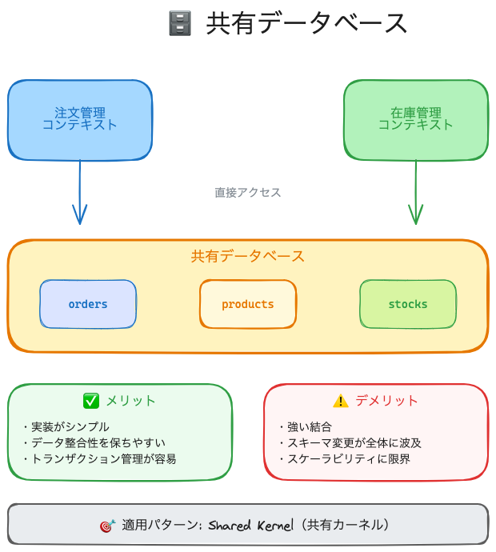
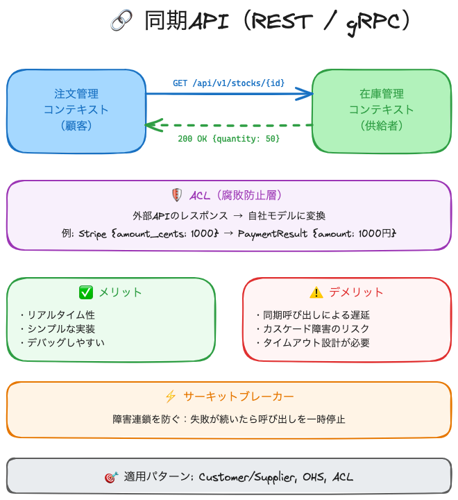
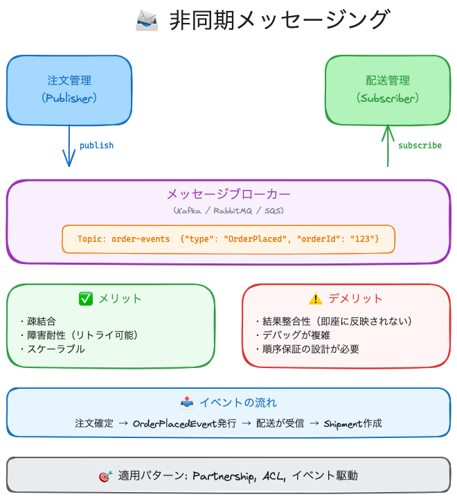
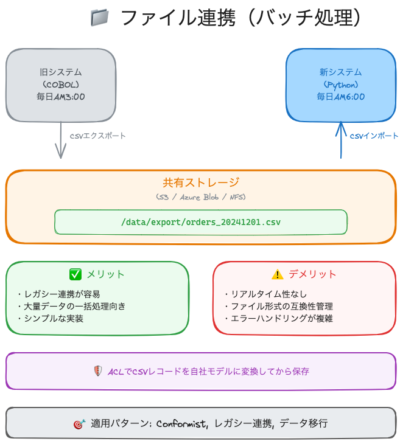

# コンテキストマッピングの技術的実現

## 目次
1. [連携の4つの技術手法](#連携の4つの技術手法)
2. [共有データベース](#️-1-共有データベース)
3. [同期API（REST / gRPC）](#-2-同期apirest--grpc)
4. [非同期メッセージング](#-3-非同期メッセージング)
5. [ファイル連携（バッチ処理）](#-4-ファイル連携バッチ処理)
6. [パターン別の推奨技術](#-パターン別の推奨技術)
7. [まとめ](#-まとめ)

---

コンテキスト間の連携パターンを、実際のシステムでどう実装するか？

---

## 連携の4つの技術手法

| 手法 | 特徴 | 適用パターン |
|------|------|-------------|
| **共有データベース** | 同じDBを参照・更新 | Shared Kernel |
| **同期API (REST/gRPC)** | リアルタイムで呼び出し | Customer/Supplier, OHS |
| **非同期メッセージング** | イベントで疎結合に連携 | ACL, Partnership |
| **ファイル連携** | バッチでデータ交換 | Conformist（レガシー連携） |

---

## 🗄️ 1. 共有データベース



**概要**: 複数のコンテキストが同じDBテーブルを直接参照・更新する

```
  ┌────────────┐     ┌────────────┐
  │  注文管理   │     │  在庫管理   │
  └─────┬──────┘     └─────┬──────┘
        │                  │
        │   直接アクセス    │
        ▼                  ▼
  ┌─────────────────────────────┐
  │      共有データベース         │
  │  ┌─────────┐ ┌─────────┐    │
  │  │ orders  │ │ stocks  │    │
  │  └─────────┘ └─────────┘    │
  └─────────────────────────────┘
```

<br>

### メリット・デメリット

| 観点 | 内容 |
|:----:|------|
| ✅ メリット | 実装がシンプル、データ整合性を保ちやすい、トランザクション管理が容易 |
| ⚠️ デメリット | 強い結合、スキーマ変更の影響が全チームに波及、スケーラビリティに限界 |
| 🎯 適用場面 | 小規模チーム、Shared Kernelパターン、モノリス→マイクロサービス移行の初期段階 |

<br>

### 実装例：共有テーブルへのアクセス

```sql
-- 注文コンテキストから在庫を確認
SELECT stock_quantity 
FROM shared.products 
WHERE product_id = 'P001';

-- 在庫コンテキストが在庫を更新
UPDATE shared.products 
SET stock_quantity = stock_quantity - 1 
WHERE product_id = 'P001';
```

<br>

### 注意点

> [!WARNING]
> **アンチパターンになりやすい**
> 
> 共有DBは便利だが、コンテキスト間の境界が曖昧になりがち。
> 以下のルールを守ること：
> - 共有するテーブルは**最小限**に絞る
> - 各コンテキストの**専用スキーマ**を分離する
> - 変更時は**全チームに事前連絡**する

---

## 🔗 2. 同期API（REST / gRPC）



**概要**: HTTPやgRPCで直接呼び出し、リアルタイムにデータを取得・更新

```
  ┌────────────┐                  ┌────────────┐
  │  注文管理   │ ──── REST ────► │  在庫管理   │
  │            │   GET /stocks   │            │
  │            │ ◄─── 200 OK ─── │            │
  └────────────┘                  └────────────┘
```

<br>

### メリット・デメリット

| 観点 | 内容 |
|:----:|------|
| ✅ メリット | リアルタイム性、シンプルな実装、デバッグしやすい |
| ⚠️ デメリット | 同期呼び出しによる遅延、障害の連鎖（カスケード障害）、タイムアウト設計が必要 |
| 🎯 適用場面 | Customer/Supplier、OHS（公開API）、リアルタイム性が求められる場面 |

<br>

### 実装例：REST API

**在庫コンテキスト（供給者）が公開するAPI:**

```python
# 在庫コンテキスト - FastAPI
@app.get("/api/v1/stocks/{product_id}")
def get_stock(product_id: str):
    stock = stock_repository.find(product_id)
    return {
        "product_id": product_id,
        "quantity": stock.quantity,
        "available": stock.quantity > 0
    }
```

**注文コンテキスト（顧客）が呼び出す:**

```python
# 注文コンテキスト
def check_stock(product_id: str) -> bool:
    response = httpx.get(f"http://stock-service/api/v1/stocks/{product_id}")
    data = response.json()
    return data["available"]
```

<br>

### ACL（腐敗防止層）を挟む例

外部APIの仕様変更から自社モデルを守る：

```python
# ACL - 外部APIのレスポンスを自社モデルに変換
class StripePaymentAdapter:
    def convert_to_payment_result(self, stripe_response: dict) -> PaymentResult:
        return PaymentResult(
            order_id=self._extract_order_id(stripe_response),
            amount=stripe_response["amount_cents"] // 100,  # セント→円
            status="completed" if stripe_response["status"] == "succeeded" else "failed"
        )
```

<br>

### 障害対策

> [!IMPORTANT]
> **サーキットブレーカーパターン**
> 
> 障害が連鎖しないよう、一定回数の失敗で呼び出しを遮断する：
> ```python
> @circuit_breaker(failure_threshold=5, recovery_timeout=30)
> def call_stock_service(product_id: str):
>     return httpx.get(f"http://stock-service/api/v1/stocks/{product_id}")
> ```

---

## 📨 3. 非同期メッセージング



**概要**: イベントをキューやトピックに発行し、購読者が非同期で処理

```
  ┌────────────┐                        ┌────────────┐
  │  注文管理   │                        │  配送管理   │
  │            │                        │            │
  └─────┬──────┘                        └─────┬──────┘
        │                                    │
        │ publish                   subscribe│
        ▼                                    ▼
  ┌─────────────────────────────────────────────────┐
  │            メッセージブローカー                   │
  │          (Kafka / RabbitMQ / SQS)              │
  │  ┌─────────────────────────────────────────┐   │
  │  │  Topic: order-events                    │   │
  │  │  { "type": "OrderPlaced", "orderId":... }│  │
  │  └─────────────────────────────────────────┘   │
  └─────────────────────────────────────────────────┘
```

<br>

### メリット・デメリット

| 観点 | 内容 |
|:----:|------|
| ✅ メリット | 疎結合、障害耐性（一時的なダウンでもリトライ可能）、スケーラブル |
| ⚠️ デメリット | 結果整合性（即座に反映されない）、デバッグが複雑、順序保証の設計が必要 |
| 🎯 適用場面 | Partnership、ACL、マイクロサービス間連携、イベント駆動アーキテクチャ |

<br>

### 実装例：ドメインイベントの発行と購読

**注文コンテキスト（イベント発行）:**

```python
# 注文が確定したらイベントを発行
class OrderService:
    def place_order(self, order: Order):
        order.confirm()
        self.order_repository.save(order)
        
        # ドメインイベントを発行
        self.event_publisher.publish(
            topic="order-events",
            event=OrderPlacedEvent(
                order_id=order.id,
                customer_id=order.customer_id,
                items=order.items,
                placed_at=datetime.now()
            )
        )
```

**配送コンテキスト（イベント購読）:**

```python
# 注文イベントを受信して配送を作成
@event_handler("order-events", event_type="OrderPlaced")
def handle_order_placed(event: OrderPlacedEvent):
    shipment = Shipment.create_from_order(
        order_id=event.order_id,
        items=event.items
    )
    shipment_repository.save(shipment)
```

<br>

### イベントスキーマの管理

> [!TIP]
> **Schema Registry を使う**
> 
> イベントのスキーマ（フォーマット）をバージョン管理し、互換性を保証：
> - Apache Avro + Confluent Schema Registry
> - JSON Schema
> - Protocol Buffers

---

## 📁 4. ファイル連携（バッチ処理）



**概要**: CSVやJSONファイルを定期的に出力・取り込み

```
  ┌────────────┐                        ┌────────────┐
  │  旧システム  │                        │  新システム  │
  │ (COBOL)    │                        │ (Python)   │
  └─────┬──────┘                        └─────┬──────┘
        │                                    │
        │ 毎日AM3:00                         │
        │ CSVエクスポート                    │ 毎日AM6:00
        ▼                                    │ CSVインポート
  ┌─────────────────────────────────────────▼──────────┐
  │                共有ストレージ                       │
  │           (S3 / Azure Blob / NFS)                 │
  │  ┌─────────────────────────────────────────────┐  │
  │  │  /data/export/orders_20241201.csv           │  │
  │  └─────────────────────────────────────────────┘  │
  └────────────────────────────────────────────────────┘
```

<br>

### メリット・デメリット

| 観点 | 内容 |
|:----:|------|
| ✅ メリット | レガシーシステムとの連携が容易、大量データの一括処理に向く |
| ⚠️ デメリット | リアルタイム性なし、ファイル形式の互換性管理、エラーハンドリングが複雑 |
| 🎯 適用場面 | Conformist（外部システムに合わせる）、レガシー連携、データ移行 |

<br>

### 実装例：CSVエクスポート/インポート

**エクスポート側（レガシー）:**

```python
# 毎日深夜にCSV出力
def export_orders_to_csv():
    orders = legacy_db.query("SELECT * FROM orders WHERE date = CURRENT_DATE")
    
    with open(f"/shared/orders_{date.today()}.csv", "w") as f:
        writer = csv.writer(f)
        writer.writerow(["order_id", "customer_id", "amount", "status"])
        for order in orders:
            writer.writerow([order.id, order.customer_id, order.amount, order.status])
```

**インポート側（新システム）:**

```python
# 毎朝CSVを読み込み
def import_orders_from_csv():
    filename = f"/shared/orders_{date.today()}.csv"
    
    with open(filename, "r") as f:
        reader = csv.DictReader(f)
        for row in reader:
            # ACLで自社モデルに変換
            order = LegacyOrderAdapter.convert(row)
            order_repository.save(order)
```

---

## 🔄 パターン別の推奨技術

| パターン | 推奨技術 | 理由 |
|---------|---------|------|
| **Partnership** | 非同期メッセージング | 対等な関係、疎結合で変更に強い |
| **Shared Kernel** | 共有データベース | 共有部分を明確にDBで表現 |
| **Customer/Supplier** | REST API | 顧客が要望を出しやすい、OpenAPI仕様で明文化 |
| **Conformist** | ファイル連携 or API | 外部に合わせるだけなので選択肢は自由 |
| **ACL** | REST API + 変換層 | 外部APIを呼び出し、自社モデルに変換 |
| **OHS** | REST API (OpenAPI) | 標準化されたAPIを公開 |

---

## ✅ まとめ

1. **共有DB** → 小規模・モノリス向け、密結合に注意
2. **同期API** → リアルタイム性重視、障害対策必須
3. **非同期メッセージング** → 疎結合・拡張性重視、複雑さとトレードオフ
4. **ファイル連携** → レガシー連携、バッチ処理向け

> [!NOTE]
> **技術選択の原則**
> 
> 「どの技術が最善か」ではなく、「このコンテキスト間の関係性に最も適した技術は何か」を考える。
> パターンを先に決め、技術は後から選ぶ。
