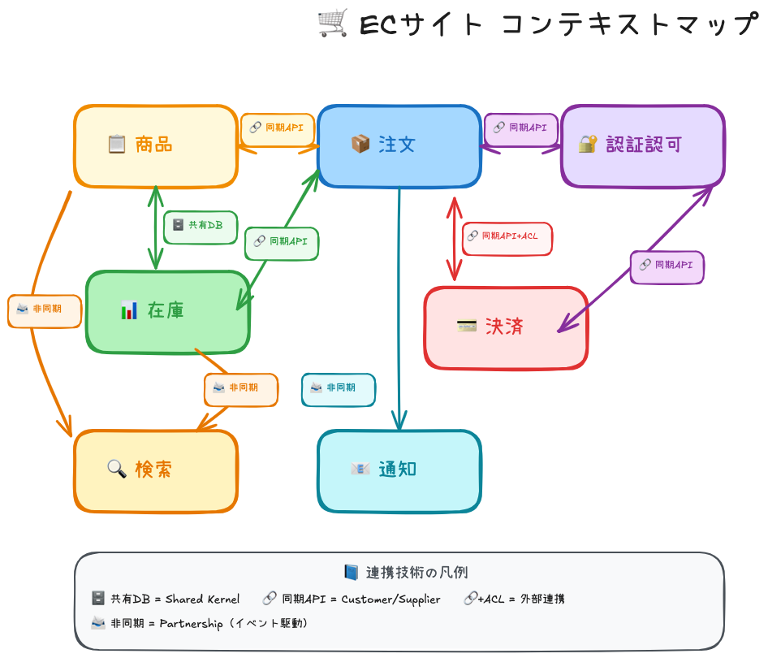

# ECサイト コンテキストマップ実例

ECサイトを題材に、コンテキスト間の連携パターンと技術選定を具体的に示す。



---

## 📋 コンテキスト構成

### 採用したコンテキスト（7個）

| コンテキスト | 責務 | 独立させた理由 |
|:----------:|------|--------------|
| 📋 **商品** | 商品マスタ・価格・カテゴリ | 全コンテキストから参照される「マスタ」 |
| 📦 **注文** | 注文受付・管理・履歴 | ECの中核。Cart、配送先も含む |
| 📊 **在庫** | 在庫数管理・引当 | 「何個あるか」は商品とは別の関心事 |
| 🔍 **検索** | 商品検索・フィルタリング | Elasticsearch等の専門技術を使用 |
| 💳 **決済** | 支払い処理・返金 | 外部連携（Stripe等）、PCI-DSS対応 |
| 📧 **通知** | メール・プッシュ通知 | 非同期処理に特化 |
| 🔐 **認証認可** | 認証・権限・ユーザー情報 | 全コンテキスト共通のID基盤 |

### 除外したコンテキスト

| コンテキスト | 理由 |
|:----------:|------|
| ~~🚚 配送~~ | 注文に統合。3PLならACL経由で十分 |
| ~~👤 顧客~~ | 認証認可に統合。ユーザー情報と認証は密接 |

---

## 🔗 連携技術と選定理由

### 一覧表

| # | 連携 | 技術 | パターン | 選定理由 |
|:-:|------|:----:|---------|---------|
| 1 | 商品 ↔ 注文 | 🔗 同期API | Customer/Supplier | 価格取得に即時性必要 |
| 2 | 商品 ↔ 在庫 | 🗄️ 共有DB | Shared Kernel | 同一チーム、ID共有が必須 |
| 3 | 商品 → 検索 | 📨 非同期 | Conformist | 遅延許容、読み取り専用 |
| 4 | 注文 ↔ 在庫 | 🔗 同期API | Customer/Supplier | 二重注文防止、即時確認 |
| 5 | 注文 ↔ 決済 | 🔗 同期API+ACL | ACL | 外部連携、即時結果必要 |
| 6 | 注文 → 通知 | 📨 非同期 | Partnership | 遅延許容、障害耐性 |
| 7 | 在庫 → 検索 | 📨 非同期 | Conformist | インデックス更新 |
| 8 | 注文 ↔ 認証認可 | 🔗 同期API | Customer/Supplier | ユーザー特定 |
| 9 | 決済 ↔ 認証認可 | 🔗 同期API | Customer/Supplier | 本人確認 |

---

### 各連携の詳細

<details>
<summary><b>1. 商品 ↔ 注文：同期API</b></summary>

**なぜ同期？** → 注文確定時に商品の**現在の価格**を即座に取得する必要がある

```
注文コンテキスト                  商品コンテキスト
     │  GET /products/{id}            │
     │ ──────────────────────────────►│
     │  {name, price, description}    │
     │ ◄──────────────────────────────│
```

</details>

<details>
<summary><b>2. 商品 ↔ 在庫：共有DB</b></summary>

**なぜ共有DB？** → 商品IDと在庫は**1対1で紐付く**必要がある。同じチームが管理。

```
┌────────────────────────────────┐
│     共有DB（products テーブル）   │
│     - product_id (PK)           │
│     - sku                       │
└────────────────────────────────┘
      ▲                  ▲
 商品コンテキスト    在庫コンテキスト
```

> [!CAUTION]
> 共有DBは**最後の手段**。チームが別れたらAPI化を検討。

</details>

<details>
<summary><b>3. 商品 → 検索：非同期</b></summary>

**なぜ非同期？** → 検索インデックス更新は**数秒の遅延OK**。障害耐性も確保。

```
商品 ──► Event Bus ──► 検索（Elasticsearch更新）
```

</details>

<details>
<summary><b>4. 注文 ↔ 在庫：同期API</b></summary>

**なぜ同期？** → 在庫確認は**即座に結果が必要**。非同期だと二重注文のリスク。

```
注文 ──► GET /stocks/{id} ──► 在庫確認
注文 ──► POST /stocks/reserve ──► 引当
```

> [!IMPORTANT]
> 在庫確認 → 引当 の間に他の注文が割り込む可能性あり。楽観ロックで対応。

</details>

<details>
<summary><b>5. 注文 ↔ 決済：同期API + ACL</b></summary>

**なぜACL？** → 外部サービス（Stripe）のAPI仕様変更から自社モデルを保護。

```
注文 ──► ACL ──► Stripe API
         │
    cents → 円 変換
```

> [!WARNING]
> 決済失敗時は在庫引当を解除する**補償トランザクション**が必要。

</details>

<details>
<summary><b>6. 注文 → 通知：非同期</b></summary>

**なぜ非同期？** → メール送信は**数分の遅延OK**。通知がダウンしても注文は継続。

```
注文 ──► Message Queue ──► 通知（メール送信）
```

</details>

<details>
<summary><b>7. 在庫 → 検索：非同期</b></summary>

**なぜ非同期？** → 在庫数の変更を検索結果に反映。「在庫あり」フィルタ用。

</details>

<details>
<summary><b>8〜9. 認証認可連携：同期API</b></summary>

**なぜ同期？** → 「誰の注文/決済か」を**リクエストごとに検証**する必要がある。

```
注文/決済 ──► Authorization: Bearer {token} ──► 認証認可
```

</details>

---

## 🎯 技術選定の判断基準

```
                    ┌─────────────────────┐
                    │ 即座に結果が必要？    │
                    └──────────┬──────────┘
                               │
              ┌────── YES ─────┴───── NO ──────┐
              ▼                                ▼
      ┌───────────────┐                ┌───────────────┐
      │  🔗 同期API    │                │  📨 非同期     │
      └───────────────┘                └───────────────┘
              │                                │
    ┌─────────┴─────────┐            ┌─────────┴─────────┐
    ▼                   ▼            ▼                   ▼
外部サービス？      内部連携？   遅延許容？         障害耐性？
    │                   │            │                   │
  ACL追加          そのまま    Message Queue      Event Bus
```

| 条件 | 選択 |
|------|------|
| 即座に結果が必要 | 🔗 同期API |
| 遅延OK・障害耐性 | 📨 非同期 |
| 外部サービス連携 | 🔗 同期API + ACL |
| 同一チーム・ID共有 | 🗄️ 共有DB（最小限） |

---

## ✅ まとめ

### 戦略的設計とは

| 問い | 内容 |
|------|------|
| **何を作るべきか？** | サブドメインの分類（コア・支援・汎用）、ビジネスルールの把握 |
| **どのように構成するか？** | コンテキストの適切な分割、変更影響性の考慮 |

> **戦略的設計の目的**
> 
> ビジネスとの乖離を防ぎ、システム構成を最適化すること

---

### コンテキストマッピングとは

> **異なるモデル間の関係性を視覚的に定義し、適切なパターンと技術を組み合わせること**

| 原則 | 説明 |
|------|------|
| **パターン → 技術** | 「関係性は何か？」を先に決め、それに最適な技術を選ぶ |
| **遅延許容 → 非同期** | 疎結合・障害耐性を高める |
| **外部連携 → ACL** | 仕様変更の影響を局所化 |
| **共有は最小限** | 密結合の元、チーム境界を意識 |
