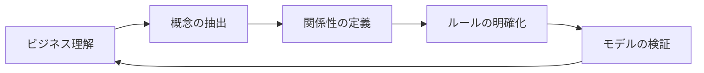
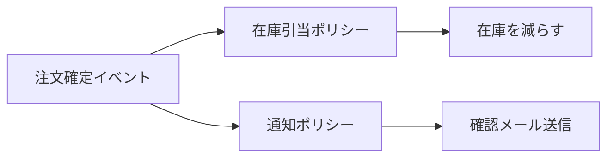

# ドメインモデリングとモデルの可視化

ドメイン駆動設計におけるモデリングの手法と、モデルを可視化することの重要性について解説します。

## 目次
1. [目的と重要性](#目的と重要性)
2. [ドメインモデリングとは](#ドメインモデリングとは)
3. [モデリングのインプットとアウトプット](#モデリングのインプットとアウトプット)
4. [集約とポリシーの表現](#集約とポリシーの表現)
5. [ビジネスルールの具体化](#ビジネスルールの具体化)
6. [本質的な課題の優先](#本質的な課題の優先)
7. [モデルの可視化手法](#モデルの可視化手法)

---

## 目的と重要性

### なぜドメインモデリングが必要か

ドメインモデリングは、ビジネスの**核となる機能・ロジック**を決定し、それを実現するために必要な**エンティティや属性**を見つけ出すプロセスです。

| 目的 | 説明 |
|------|------|
| **共通理解の形成** | 開発者とドメインエキスパート間で同じ言葉・概念を共有する |
| **複雑性の管理** | ビジネスロジックを整理し、システムの複雑性をコントロールする |
| **変更への対応** | ビジネス変化に追従しやすい設計を実現する |
| **品質の向上** | ビジネスルールを明確にすることでバグを減らす |

### モデルを可視化することの重要性

```
ビジネス要件 → ドメインモデル → 実装コード
     ↑              ↑              ↑
   曖昧            明確           具体的
```

可視化することで：
- 認識のズレを早期に発見できる
- ステークホルダーとの合意形成が容易になる
- 設計の問題点が見えやすくなる

---

## ドメインモデリングとは

### 定義

ドメインモデリングとは、**ビジネスドメインの本質的な概念と関係性**を抽出し、ソフトウェアで表現可能な形に整理するプロセスです。

### モデリングの流れ



> **📝 ポイント**  
> モデリングは一度で完成するものではなく、**反復的に洗練**させていくプロセスです。

---

## モデリングのインプットとアウトプット

### 必要なインプット

| インプット | 具体例 |
|-----------|--------|
| **ビジネス要件** | ユースケース、業務フロー、ビジネスゴール |
| **ドメイン知識** | 業界用語、業務ルール、制約条件 |
| **既存システム情報** | 現行システムのデータ構造、処理フロー |
| **ステークホルダーの声** | ドメインエキスパートへのヒアリング結果 |

### アウトプットの明確化

| アウトプット | 説明 |
|-------------|------|
| **ユビキタス言語** | チーム全体で共有する用語集 |
| **ドメインモデル図** | エンティティ、値オブジェクト、集約の関係図 |
| **ビジネスルール定義** | 制約条件、不変条件の明文化 |
| **境界づけられたコンテキスト** | モデルの適用範囲の定義 |

---

## 集約とポリシーの表現

### 集約（Aggregate）とは

集約は、**データの整合性を保つ単位**として機能する、関連するオブジェクトのまとまりです。

```
┌─────────────────────────────────┐
│         Order（集約ルート）        │
│  ┌───────────┐ ┌─────────────┐  │
│  │ OrderItem │ │ OrderStatus │  │
│  └───────────┘ └─────────────┘  │
└─────────────────────────────────┘
          ▲
          │ 外部からのアクセスは
          │ 集約ルート経由のみ
```

### 集約設計のポイント

| ポイント | 説明 |
|---------|------|
| **小さく保つ** | 集約は必要最小限のサイズにする |
| **トランザクション境界** | 1つのトランザクションで1つの集約を更新 |
| **整合性の保証** | 集約内のデータは常に整合性を保つ |

### ポリシー（ドメインイベントとの連携）

ポリシーは、**あるイベントが発生したときに実行されるビジネスルール**です。



---

## ビジネスルールの具体化

### ビジネスルールの種類

| 種類 | 説明 | 例 |
|------|------|-----|
| **制約ルール** | 値の範囲や形式の制限 | 「数量は1以上100以下」 |
| **導出ルール** | 他の値から計算される値 | 「合計金額 = 単価 × 数量」 |
| **アクションルール** | 条件に応じた処理 | 「10個以上で10%割引」 |
| **推論ルール** | 状態の判定 | 「在庫が0なら品切れ」 |

### ルールの表現方法

**値オブジェクトでの表現例:**

```typescript
// 数量を値オブジェクトとして表現
class Quantity {
  private readonly value: number;

  constructor(value: number) {
    if (value < 1 || value > 100) {
      throw new Error('数量は1以上100以下である必要があります');
    }
    this.value = value;
  }

  getValue(): number {
    return this.value;
  }
}
```

**ドメインサービスでの表現例:**

```typescript
// 割引計算のドメインサービス
class DiscountService {
  calculateDiscount(quantity: Quantity, unitPrice: Money): Money {
    if (quantity.getValue() >= 10) {
      return unitPrice.multiply(0.1); // 10%割引
    }
    return Money.zero();
  }
}
```

---

## 本質的な課題の優先

### コアサブドメインを優先する

すべてのドメインに同じ労力をかけるのではなく、**ビジネス価値の高いコアサブドメイン**に注力することが重要です。

```
        ┌─────────────────┐
        │  コアサブドメイン  │ ← 最優先でモデリング
        │  （競争優位性）    │    高品質なモデルが必要
        └────────┬────────┘
                 │
        ┌────────┴────────┐
        │  支援サブドメイン  │ ← 適度な品質でモデリング
        │  （業務を支援）    │    コアの質を落とさない範囲で
        └────────┬────────┘
                 │
        ┌────────┴────────┐
        │  汎用サブドメイン  │ ← 既存ソリューションを活用
        │  （一般的な機能）  │    自前で作らない選択も
        └─────────────────┘
```

### 優先順位の判断基準

| 基準 | 質問 |
|------|------|
| **ビジネス価値** | この機能で収益を生んでいるか？ |
| **差別化要因** | 競合との違いを生み出しているか？ |
| **複雑性** | ビジネスルールが複雑か？ |
| **変更頻度** | 頻繁に変更が発生するか？ |

---

## モデルの可視化手法

### 1. ドメインモデル図

エンティティ、値オブジェクト、集約の関係を表現します。

```
┌──────────────────────────────────────────┐
│              Order Aggregate              │
│  ┌────────────────────────────────────┐  │
│  │ Order <<Entity>> <<Aggregate Root>>│  │
│  │ - orderId: OrderId                 │  │
│  │ - customerId: CustomerId           │  │
│  │ - status: OrderStatus              │  │
│  │ - totalAmount: Money               │  │
│  └────────────────────────────────────┘  │
│           │ 1                             │
│           │                               │
│           ▼ *                             │
│  ┌────────────────────────────────────┐  │
│  │ OrderItem <<Entity>>               │  │
│  │ - productId: ProductId             │  │
│  │ - quantity: Quantity               │  │
│  │ - unitPrice: Money                 │  │
│  └────────────────────────────────────┘  │
└──────────────────────────────────────────┘
```

### 2. イベントストーミング

ドメインイベントを中心にビジネスプロセスを可視化する手法です。

```
┌─────────┐    ┌─────────┐    ┌─────────┐
│ Command │ → │  Event  │ → │ Policy  │
│ 注文する │    │注文された│    │在庫を引く│
└─────────┘    └─────────┘    └─────────┘
     ▲                             │
     │                             ▼
┌─────────┐                  ┌─────────┐
│  Actor  │                  │  Event  │
│   顧客   │                  │在庫引当済│
└─────────┘                  └─────────┘
```

### 3. コンテキストマップ

境界づけられたコンテキスト間の関係を可視化します。

> **📝 参考**  
> コンテキストマップの詳細は [06_context_mapping.md](./06_context_mapping.md) を参照してください。

---

## まとめ

| 項目 | 要点 |
|------|------|
| **ドメインモデリングの目的** | ビジネスの核となる機能・ロジックを決定し、必要なエンティティや属性を見つける |
| **インプット** | ビジネス要件、ドメイン知識、ステークホルダーの声 |
| **アウトプット** | ユビキタス言語、ドメインモデル図、ビジネスルール定義 |
| **優先順位** | コアサブドメインを最優先でモデリングする |
| **可視化の重要性** | 認識のズレを防ぎ、合意形成を促進する |

---

## 参考リンク

- [01_ddd_introduction.md](./01_ddd_introduction.md) - DDD入門
- [04_subdomain.md](./04_subdomain.md) - サブドメインの分類
- [05_bounded_context.md](./05_bounded_context.md) - 境界づけられたコンテキスト
