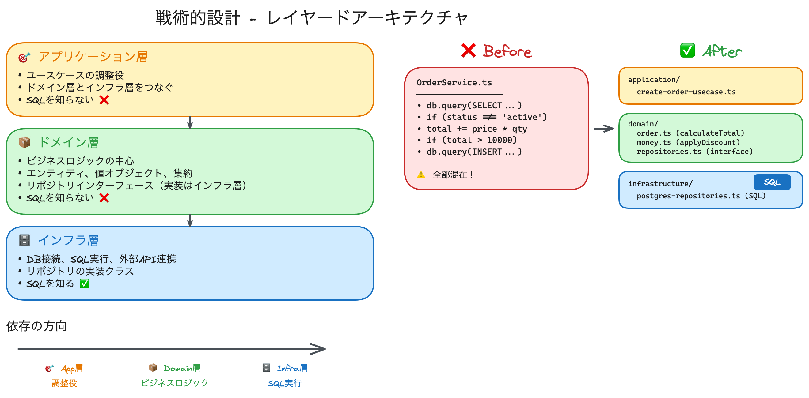

# 戦術的設計（Tactical Design）

戦略的設計で「何を作るべきか」を決めた後、**どのようにドメインをコードで表現するか**を定義するのが戦術的設計です。

## 目次
1. [戦術的設計とは](#戦術的設計とは)
2. [なぜ戦術的設計が必要なのか](#なぜ戦術的設計が必要なのか)
3. [レイヤードアーキテクチャ](#レイヤードアーキテクチャ)
4. [Before/After 比較](#beforeafter-比較)
5. [戦術的設計の構成要素](#戦術的設計の構成要素)
6. [まとめ](#まとめ)

---

## 戦術的設計とは

戦術的設計は、ドメインモデルを**実装レベル**で表現するためのパターンと手法の集まりです。

| 戦略的設計（何を作るか） | → | 戦術的設計（どう作るか） |
|:----------------------:|:-:|:----------------------:|
| サブドメイン | → | エンティティ |
| 境界づけられたコンテキスト | → | 値オブジェクト |
| コンテキストマップ | → | 集約、リポジトリ |

---

## なぜ戦術的設計が必要なのか

戦術的設計がない場合、以下の問題が発生します。

| 問題 | 症状 |
|------|------|
| **データ中心の実装** | SQLとビジネスロジックが混在 |
| **一貫性のない実装** | 同じルールが複数箇所でバラバラに実装 |
| **ドメイン知識が埋もれる** | `type === 1` など意図不明なコード |
| **変更に弱い** | 一箇所の変更が全体に波及 |

---

## レイヤードアーキテクチャ

戦術的設計では、コードを**3つの層**に分離します。



> 📎 **編集**: [Excalidrawで開く](../other/10_tactical_design/tactical_design.excalidraw)

### 📊 層の構成図

```
┌─────────────────────────────────────────────────────────────────┐
│                                                                  │
│   🎯 アプリケーション層（application/）                          │
│   ────────────────────────────────────────                       │
│   ユースケースの調整役。ドメイン層とインフラ層をつなぐ。           │
│   SQLを知らない。                                                │
│                                                                  │
├─────────────────────────────────────────────────────────────────┤
│                                                                  │
│   📦 ドメイン層（domain/）                                       │
│   ────────────────────────────────────────                       │
│   ビジネスロジックの中心。エンティティ、値オブジェクト、           │
│   リポジトリのインターフェースを定義。SQLを知らない。              │
│                                                                  │
├─────────────────────────────────────────────────────────────────┤
│                                                                  │
│   🗄️ インフラ層（infrastructure/）                              │
│   ────────────────────────────────────────                       │
│   技術的な実装詳細。DB接続、SQL実行、外部API連携など。            │
│   ドメイン層のインターフェースを実装。                            │
│                                                                  │
└─────────────────────────────────────────────────────────────────┘
```

### 📁 ディレクトリ構成

```
src/
├── application/           # 🎯 アプリケーション層
│   └── create-order-usecase.ts
│
├── domain/                # 📦 ドメイン層
│   ├── order.ts           # エンティティ
│   ├── money.ts           # 値オブジェクト
│   └── repositories.ts    # リポジトリ（インターフェース）
│
└── infrastructure/        # 🗄️ インフラ層
    └── postgres-repositories.ts  # リポジトリ（SQL実装）
```

### 各層の責務

| 層 | 責務 | SQLを知る？ |
|:--:|------|:----------:|
| 🎯 **アプリケーション層** | ユースケースの調整 | ❌ No |
| 📦 **ドメイン層** | ビジネスロジック | ❌ No |
| 🗄️ **インフラ層** | DB接続、SQL実行 | ✅ Yes |

---

## Before/After 比較

### ❌ Before: すべてが1ファイルに混在

```typescript
// ❌ order-service.ts - 全部入り（悪い例）

class OrderService {
  createOrder(customerId: string, items: any[]) {
    // ❌ SQLがサービス内に直接
    const customer = db.query(
      `SELECT * FROM customers WHERE id = ?`, 
      customerId
    );
    
    // ❌ ビジネスルールがSQLと混在
    if (customer.status !== 'active') {
      throw new Error('無効な顧客');
    }
    
    // ❌ 計算ロジックがここに
    let total = 0;
    for (const item of items) {
      const product = db.query(
        `SELECT * FROM products WHERE id = ?`, 
        item.productId
      );
      total += product.price * item.quantity;
    }
    
    // ❌ 割引ルールがマジックナンバー
    if (total > 10000) {
      total = total * 0.9;
    }
    
    // ❌ SQLで保存
    db.query(`INSERT INTO orders ...`);
  }
}
```

---

### ✅ After: 層ごとにファイル分割

#### 📦 **domain/money.ts** - 値オブジェクト

```typescript
// 金額を表現（不変、バリデーション付き）
export class Money {
  constructor(private readonly amount: number) {
    if (amount < 0) {
      throw new Error('金額は0以上である必要があります');
    }
  }

  add(other: Money): Money {
    return new Money(this.amount + other.amount);
  }

  applyDiscount(rate: number): Money {
    return new Money(this.amount * (1 - rate));
  }

  getValue(): number {
    return this.amount;
  }
}
```

---

#### 📦 **domain/order.ts** - エンティティ

```typescript
import { Money } from './money';

export class Order {
  constructor(
    private readonly orderId: OrderId,
    private readonly customerId: CustomerId,
    private items: OrderItem[],
    private status: OrderStatus
  ) {}

  // ビジネスロジックがエンティティ内に
  calculateTotal(): Money {
    return this.items.reduce(
      (total, item) => total.add(item.getSubtotal()),
      new Money(0)
    );
  }

  applyBulkDiscount(): void {
    if (this.calculateTotal().getValue() >= 10000) {
      // 割引ポリシーを適用
    }
  }
}
```

---

#### 📦 **domain/repositories.ts** - リポジトリインターフェース

```typescript
// ⚠️ インターフェースのみ（実装はインフラ層）
// ⚠️ SQLを一切知らない

export interface CustomerRepository {
  findById(id: CustomerId): Customer;
}

export interface OrderRepository {
  save(order: Order): void;
}
```

---

#### 🗄️ **infrastructure/postgres-repositories.ts** - SQL実装

```typescript
// ✅ SQLはここだけ！

import { CustomerRepository, OrderRepository } from '../domain/repositories';

export class PostgresCustomerRepository implements CustomerRepository {
  findById(id: CustomerId): Customer {
    // 👇 Beforeの db.query() はここに移動
    const row = db.query(
      `SELECT * FROM customers WHERE id = ?`, 
      id.value
    );
    return Customer.fromRow(row);
  }
}

export class PostgresOrderRepository implements OrderRepository {
  save(order: Order): void {
    // 👇 Beforeの db.query() はここに移動
    db.query(`INSERT INTO orders ...`, order.toRow());
  }
}
```

---

#### 🎯 **application/create-order-usecase.ts** - ユースケース

```typescript
// ✅ SQLを知らない。リポジトリ経由でアクセス。

import { CustomerRepository, OrderRepository } from '../domain/repositories';
import { Order } from '../domain/order';

export class CreateOrderUseCase {
  constructor(
    private customerRepo: CustomerRepository,
    private orderRepo: OrderRepository
  ) {}

  execute(customerId: string, items: OrderItemInput[]): void {
    // リポジトリ経由でデータ取得
    const customer = this.customerRepo.findById(
      new CustomerId(customerId)
    );
    
    if (!customer.isActive()) {
      throw new Error('無効な顧客');
    }

    const order = Order.create(customer.id, items);
    order.applyBulkDiscount();

    // リポジトリ経由で保存
    this.orderRepo.save(order);
  }
}
```

---

### 🔍 変更の要約

| Before | After | 移動先 |
|--------|-------|--------|
| `db.query(SELECT...)` | `customerRepo.findById()` | 🗄️ infrastructure/ |
| `db.query(INSERT...)` | `orderRepo.save()` | 🗄️ infrastructure/ |
| `total += price * qty` | `order.calculateTotal()` | 📦 domain/order.ts |
| `if (total > 10000)` | `order.applyBulkDiscount()` | 📦 domain/order.ts |

---

## 戦術的設計の構成要素

| 構成要素 | 説明 | 層 |
|---------|------|:--:|
| **エンティティ** | 一意なIDを持つオブジェクト | 📦 domain |
| **値オブジェクト** | 不変で属性で比較されるオブジェクト | 📦 domain |
| **集約** | 整合性の境界、トランザクション単位 | 📦 domain |
| **リポジトリ** | 永続化の抽象化 | 📦 interface, 🗄️ impl |
| **ドメインサービス** | エンティティに属さない処理 | 📦 domain |
| **ファクトリ** | 複雑なオブジェクト生成 | 📦 domain |
| **ドメインイベント** | ドメインで起きた出来事 | 📦 domain |

---

## まとめ

### Before → After の変化

| 観点 | ❌ Before | ✅ After |
|:----:|:---------|:---------|
| SQLの場所 | サービス内に直接 | インフラ層に分離 |
| ビジネスロジック | SQLと混在 | ドメイン層に集約 |
| テスト | 実DBが必要 | モックで単体テスト可能 |
| 変更影響 | 全体に波及 | 該当層に限定 |

### 層の分離ルール

```
🎯 アプリケーション層 → 📦 ドメイン層 → 🗄️ インフラ層
        ↓                    ↓                ↓
    調整役に徹する      ビジネスロジック    SQL実行
    SQLを知らない       SQLを知らない       SQLを知る
```

> **📝 次のステップ**  
> 各構成要素（エンティティ、値オブジェクト、集約など）の詳細は、今後のドキュメントで解説します。

---

## 参考リンク

- [01_ddd_introduction.md](./01_ddd_introduction.md) - DDD入門
- [09_domain_modeling.md](./09_domain_modeling.md) - ドメインモデリングと可視化
