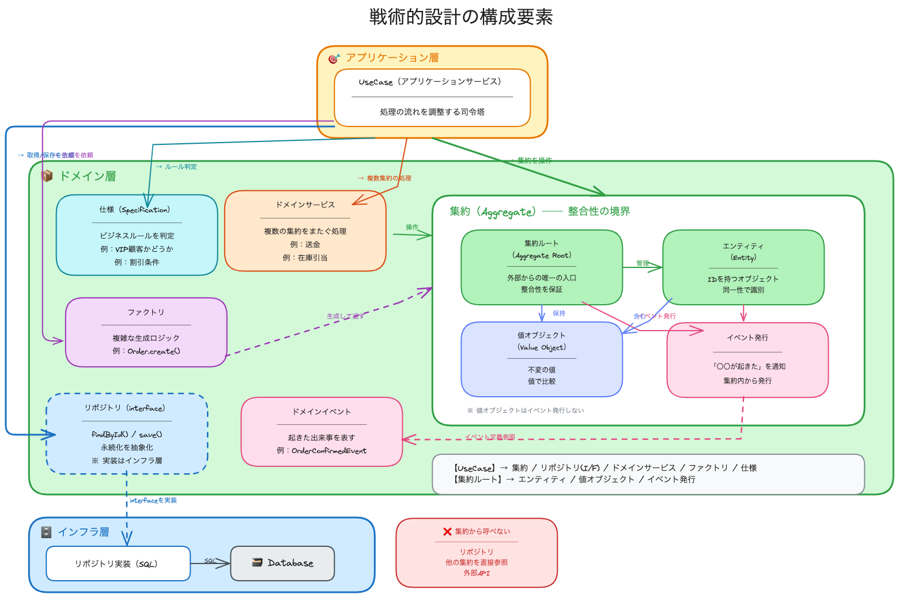

# 戦術的設計の構成要素

戦術的設計でドメインモデルを実装するための主要なパターンを解説します。

## 目次
1. [値オブジェクト（Value Object）](#値オブジェクトvalue-object)
2. [エンティティ（Entity）](#エンティティentity)
3. [集約（Aggregate）](#集約aggregate)
4. [リポジトリ（Repository）](#リポジトリrepository)
5. [ドメインサービス（Domain Service）](#ドメインサービスdomain-service)
6. [アプリケーションサービス（Application Service）](#アプリケーションサービスapplication-service)
7. [ドメインイベント（Domain Event）](#ドメインイベントdomain-event)
8. [ファクトリ（Factory）](#ファクトリfactory)
9. [仕様（Specification）](#仕様specification)
10. [🛒 実践例：カートに商品を追加する](#-実践例カートに商品を追加する)
11. [まとめ](#まとめ)

---

## 値オブジェクト（Value Object）

**属性の値そのものに意味があるオブジェクト**。同一性ではなく、値で比較される。

### 特徴

| 特徴 | 説明 |
|------|------|
| **不変（Immutable）** | 一度作成したら変更できない |
| **等価性** | 属性の値が同じなら等しい |
| **副作用がない** | 操作しても他に影響しない |
| **交換可能** | 同じ値なら置き換えても問題ない |

### コード例

```typescript
// ❌ プリミティブ型をそのまま使う（悪い例）
function createOrder(price: number, email: string) {
  // price が負の値でも通ってしまう
  // email が不正な形式でも通ってしまう
}

// ✅ 値オブジェクトを使う（良い例）
class Money {
  constructor(private readonly amount: number) {
    if (amount < 0) {
      throw new Error('金額は0以上である必要があります');
    }
  }

  // 不変：新しいインスタンスを返す
  add(other: Money): Money {
    return new Money(this.amount + other.amount);
  }

  // 等価性：値で比較
  equals(other: Money): boolean {
    return this.amount === other.amount;
  }
}

class Email {
  constructor(private readonly value: string) {
    if (!this.isValid(value)) {
      throw new Error('不正なメールアドレスです');
    }
  }

  private isValid(email: string): boolean {
    return /^[^\s@]+@[^\s@]+\.[^\s@]+$/.test(email);
  }
}
```

### 値オブジェクトの例

| 例 | 説明 |
|----|------|
| `Money` | 金額（amount + currency） |
| `Email` | メールアドレス |
| `Address` | 住所（郵便番号、都道府県、市区町村...） |
| `DateRange` | 期間（開始日〜終了日） |
| `Color` | 色（RGB値） |

---

## エンティティ（Entity）

**一意な識別子（ID）を持ち、ライフサイクルを通じて同一性を保つオブジェクト**。

### 特徴

| 特徴 | 説明 |
|------|------|
| **識別子を持つ** | UUID、連番などで一意に識別 |
| **同一性** | IDが同じなら同一とみなす |
| **可変** | 状態が変化しうる |
| **ライフサイクル** | 作成→更新→削除の流れがある |

### コード例

```typescript
class Order {
  constructor(
    private readonly id: OrderId,      // 識別子
    private customerId: CustomerId,
    private items: OrderItem[],
    private status: OrderStatus        // 状態が変化する
  ) {}

  // IDで同一性を判断
  equals(other: Order): boolean {
    return this.id.equals(other.id);
  }

  // 状態を変更するメソッド
  confirm(): void {
    if (this.status !== OrderStatus.PENDING) {
      throw new Error('確定できない状態です');
    }
    this.status = OrderStatus.CONFIRMED;
  }

  cancel(): void {
    if (this.status === OrderStatus.SHIPPED) {
      throw new Error('発送済みの注文はキャンセルできません');
    }
    this.status = OrderStatus.CANCELLED;
  }
}
```

### 値オブジェクト vs エンティティ

| 観点 | 値オブジェクト | エンティティ |
|:----:|:------------:|:----------:|
| 識別子 | なし | あり |
| 比較方法 | 値で比較 | IDで比較 |
| 不変性 | 不変 | 可変 |
| 例 | Money, Email | Order, User |

---

## 集約（Aggregate）

**関連するエンティティと値オブジェクトをグループ化し、整合性の境界を定義する**。

### 特徴

| 特徴 | 説明 |
|------|------|
| **集約ルート** | 外部からアクセスする唯一の入口 |
| **整合性の境界** | 集約内は常に整合性を保つ |
| **トランザクション境界** | 1つの集約 = 1つのトランザクション |
| **参照は ID で** | 他の集約は IDのみ で参照 |

### コード例

```typescript
// Order（集約ルート）
class Order {
  constructor(
    private readonly id: OrderId,
    private readonly customerId: CustomerId,  // 他の集約はIDで参照
    private items: OrderItem[],               // 集約内のエンティティ
    private shippingAddress: Address          // 集約内の値オブジェクト
  ) {}

  // 集約ルート経由でのみ操作
  addItem(product: ProductId, quantity: number): void {
    // 整合性チェック
    if (this.items.length >= 10) {
      throw new Error('注文は10品目までです');
    }
    this.items.push(new OrderItem(product, quantity));
  }

  removeItem(itemId: OrderItemId): void {
    this.items = this.items.filter(item => !item.id.equals(itemId));
  }
}

// OrderItem（集約内のエンティティ）
// ⚠️ 外部から直接アクセスしない！Order経由でアクセス
class OrderItem {
  constructor(
    readonly id: OrderItemId,
    readonly productId: ProductId,
    readonly quantity: number
  ) {}
}
```

### 集約設計のポイント

```
┌─────────────────────────────────────────┐
│  Order（集約ルート）                      │
│  ─────────────────────────────          │
│                                          │
│   ┌──────────────┐  ┌──────────────┐    │
│   │ OrderItem    │  │ OrderItem    │    │
│   └──────────────┘  └──────────────┘    │
│                                          │
│   ┌──────────────────────────────────┐  │
│   │ Address（値オブジェクト）          │  │
│   └──────────────────────────────────┘  │
│                                          │
└─────────────────────────────────────────┘
         ↑
    外部からはここだけ
```

---

## リポジトリ（Repository）

**集約の永続化と取得を抽象化するインターフェース**。コレクションのように振る舞う。

### 特徴

| 特徴 | 説明 |
|------|------|
| **永続化の抽象化** | SQLを隠蔽 |
| **集約ルートごと** | 1集約 = 1リポジトリ |
| **コレクション風** | `find`, `save`, `remove` |
| **インターフェース** | ドメイン層で定義、インフラ層で実装 |

### コード例

```typescript
// 📦 domain/repositories.ts（インターフェース）
interface OrderRepository {
  findById(id: OrderId): Order | null;
  findByCustomerId(customerId: CustomerId): Order[];
  save(order: Order): void;
  remove(order: Order): void;
}

// 🗄️ infrastructure/postgres-order-repository.ts（実装）
class PostgresOrderRepository implements OrderRepository {
  findById(id: OrderId): Order | null {
    const row = db.query(
      `SELECT * FROM orders WHERE id = ?`,
      id.value
    );
    return row ? Order.fromRow(row) : null;
  }

  save(order: Order): void {
    db.query(
      `INSERT INTO orders ... ON CONFLICT UPDATE ...`,
      order.toRow()
    );
  }
}
```

---

## ドメインサービス（Domain Service）

**エンティティや値オブジェクトに属さないドメインロジック**を表現する。

### いつ使う？

| 使う場面 | 例 |
|---------|---|
| 複数の集約にまたがる処理 | 在庫確認 + 注文作成 |
| 外部サービスとの連携 | 決済処理 |
| 計算ロジック | 割引計算、手数料計算 |

### コード例

```typescript
// 📦 domain/services/discount-policy.ts
class DiscountPolicy {
  calculate(order: Order, customer: Customer): Money {
    let discount = new Money(0);

    // 会員ランクによる割引
    if (customer.isGoldMember()) {
      discount = discount.add(order.total().multiply(0.1));
    }

    // 大量注文割引
    if (order.itemCount() >= 10) {
      discount = discount.add(new Money(500));
    }

    return discount;
  }
}

// 📦 domain/services/transfer-service.ts
class TransferService {
  // 複数の集約（口座）にまたがる処理
  transfer(from: Account, to: Account, amount: Money): void {
    from.withdraw(amount);
    to.deposit(amount);
  }
}
```

---

## アプリケーションサービス（Application Service）

**ユースケースを調整する薄いレイヤー**。ドメインロジックは持たない。

### 特徴

| 特徴 | 説明 |
|------|------|
| **ユースケースの調整** | 処理の流れを組み立てる |
| **トランザクション管理** | 開始・コミット・ロールバック |
| **認証・認可** | 権限チェック |
| **ドメインロジックを持たない** | 薄く保つ |

### コード例

```typescript
// 🎯 application/create-order-usecase.ts
class CreateOrderUseCase {
  constructor(
    private orderRepo: OrderRepository,
    private customerRepo: CustomerRepository,
    private discountPolicy: DiscountPolicy,
    private transactionManager: TransactionManager
  ) {}

  @Transactional()
  execute(input: CreateOrderInput): OrderId {
    // 1. 顧客を取得
    const customer = this.customerRepo.findById(input.customerId);
    if (!customer) throw new Error('顧客が見つかりません');

    // 2. 注文を作成（ドメインロジックはOrder内）
    const order = Order.create(customer.id, input.items);

    // 3. 割引を適用（ドメインサービス）
    const discount = this.discountPolicy.calculate(order, customer);
    order.applyDiscount(discount);

    // 4. 保存
    this.orderRepo.save(order);

    return order.id;
  }
}
```

### ドメインサービス vs アプリケーションサービス

| 観点 | ドメインサービス | アプリケーションサービス |
|:----:|:-------------:|:-------------------:|
| 層 | 📦 ドメイン層 | 🎯 アプリケーション層 |
| 責務 | ビジネスロジック | ユースケースの調整 |
| 例 | 割引計算、振込処理 | 注文作成、ユーザー登録 |

---

## ドメインイベント（Domain Event）

**ドメインで起きた重要な出来事を表すオブジェクト**。

### 特徴

| 特徴 | 説明 |
|------|------|
| **過去形で命名** | `OrderPlaced`, `PaymentCompleted` |
| **不変** | 発生した事実は変わらない |
| **タイムスタンプ** | いつ発生したか |
| **疎結合** | 発行者と購読者を分離 |

### コード例

```typescript
// イベント定義
class OrderPlacedEvent {
  readonly occurredAt: Date;

  constructor(
    readonly orderId: OrderId,
    readonly customerId: CustomerId,
    readonly totalAmount: Money
  ) {
    this.occurredAt = new Date();
  }
}

// イベント発行
class Order {
  private events: DomainEvent[] = [];

  place(): void {
    this.status = OrderStatus.PLACED;
    
    // イベントを発行
    this.events.push(new OrderPlacedEvent(
      this.id,
      this.customerId,
      this.calculateTotal()
    ));
  }

  pullEvents(): DomainEvent[] {
    const events = [...this.events];
    this.events = [];
    return events;
  }
}

// イベント購読（別のコンテキストで処理）
class OrderPlacedHandler {
  handle(event: OrderPlacedEvent): void {
    // メール送信、在庫引当、ポイント付与など
    this.emailService.sendOrderConfirmation(event.customerId);
  }
}
```

---

## ファクトリ（Factory）

**複雑なオブジェクト生成ロジックをカプセル化する**。

### いつ使う？

| 使う場面 | 例 |
|---------|---|
| 生成ロジックが複雑 | 複数の依存関係がある |
| 生成時のバリデーション | 整合性チェックが必要 |
| 集約の再構築 | DBからの復元 |

### コード例

```typescript
// ファクトリメソッド（エンティティ内）
class Order {
  static create(
    customerId: CustomerId,
    items: CreateOrderItemInput[]
  ): Order {
    if (items.length === 0) {
      throw new Error('注文には1つ以上の商品が必要です');
    }

    return new Order(
      OrderId.generate(),
      customerId,
      items.map(i => new OrderItem(i.productId, i.quantity)),
      OrderStatus.PENDING
    );
  }

  // DBからの再構築
  static fromPersistence(row: OrderRow): Order {
    return new Order(
      new OrderId(row.id),
      new CustomerId(row.customer_id),
      row.items.map(OrderItem.fromPersistence),
      OrderStatus.fromString(row.status)
    );
  }
}
```

---

## 仕様（Specification）

**ビジネスルールや条件をオブジェクトとして表現する**。

### コード例

```typescript
// 仕様パターン
interface Specification<T> {
  isSatisfiedBy(entity: T): boolean;
}

class PremiumCustomerSpec implements Specification<Customer> {
  isSatisfiedBy(customer: Customer): boolean {
    return customer.totalPurchases().getValue() >= 100000
        && customer.accountAge() >= 365;
  }
}

class ActiveOrderSpec implements Specification<Order> {
  isSatisfiedBy(order: Order): boolean {
    return order.status !== OrderStatus.CANCELLED
        && order.status !== OrderStatus.DELIVERED;
  }
}

// 使用例
const premiumSpec = new PremiumCustomerSpec();
const premiumCustomers = customers.filter(c => premiumSpec.isSatisfiedBy(c));
```

---

## 🛒 実践例：カートに商品を追加する

「カートに商品を追加する」ユースケースを例に、各構成要素がどう連携するかを見ていきます。

### 全体フロー図

```
┌─────────────────────────────────────────────────────────────────────────┐
│                                                                          │
│  ① ユーザーが「カートに追加」ボタンをクリック                              │
│     POST /cart/items { productId: "P001", quantity: 2 }                  │
│                                                                          │
│                              ↓                                           │
│                                                                          │
│  ② Controller（プレゼンテーション層）                                     │
│     リクエストを受け取り、UseCaseを呼び出す                               │
│                                                                          │
│                              ↓                                           │
│                                                                          │
│  ③ AddToCartUseCase（🎯 アプリケーションサービス）                        │
│     ユースケースの調整役                                                  │
│     ├→ CartRepository.findByUserId()  ──→ 🗄️ SQL実行                   │
│     ├→ ProductRepository.findById()   ──→ 🗄️ SQL実行                   │
│     ├→ Cart.addItem()                 ──→ 📦 ビジネスロジック            │
│     └→ CartRepository.save()          ──→ 🗄️ SQL実行                   │
│                                                                          │
│                              ↓                                           │
│                                                                          │
│  ④ Cart（📦 集約ルート）                                                 │
│     └→ CartItem を追加（集約内のエンティティ）                            │
│     └→ Money で小計計算（値オブジェクト）                                 │
│                                                                          │
│                              ↓                                           │
│                                                                          │
│  ⑤ Repository実装（🗄️ インフラ層）                                      │
│     INSERT INTO cart_items ...                                           │
│                                                                          │
└─────────────────────────────────────────────────────────────────────────┘
```

---

### 構成要素の関係図

```
┌──────────────────────────────────────────────────────────────────────────┐
│                         🎯 アプリケーション層                              │
│  ┌────────────────────────────────────────────────────────────────────┐  │
│  │  AddToCartUseCase                                                   │  │
│  │  ─────────────────                                                  │  │
│  │  • CartRepository（interface）を使用                                │  │
│  │  • ProductRepository（interface）を使用                             │  │
│  │  • Cart（集約）のメソッドを呼び出す                                  │  │
│  └────────────────────────────────────────────────────────────────────┘  │
└──────────────────────────────────────────────────────────────────────────┘
                                     │
                                     │ 依存
                                     ▼
┌──────────────────────────────────────────────────────────────────────────┐
│                            📦 ドメイン層                                  │
│                                                                           │
│  ┌─────────────────────────────────┐    ┌─────────────────────────────┐  │
│  │  Cart（集約ルート）               │    │  Product（集約ルート）       │  │
│  │  ─────────────────               │    │  ────────────────           │  │
│  │  • id: CartId                   │    │  • id: ProductId            │  │
│  │  • userId: UserId               │    │  • name: ProductName        │  │
│  │  • items: CartItem[]            │    │  • price: Money（値obj）    │  │
│  │  • addItem()                    │    │  • stock: number            │  │
│  │  • removeItem()                 │    └─────────────────────────────┘  │
│  │  • calculateTotal()             │                                      │
│  │                                  │    ┌─────────────────────────────┐  │
│  │  ┌────────────────────────────┐ │    │  CartRepository（interface）│  │
│  │  │ CartItem（エンティティ）    │ │    │  ──────────────────────────  │  │
│  │  │ • id: CartItemId           │ │    │  • findByUserId()           │  │
│  │  │ • productId: ProductId     │ │    │  • save()                   │  │
│  │  │ • quantity: Quantity       │ │    └─────────────────────────────┘  │
│  │  │ • subtotal(): Money        │ │                                      │
│  │  └────────────────────────────┘ │                                      │
│  └─────────────────────────────────┘                                      │
│                                                                           │
│  ┌──────────────────────────────────────────────────────────────────────┐│
│  │  値オブジェクト                                                       ││
│  │  • Money（金額）  • Quantity（数量）  • ProductName（商品名）         ││
│  └──────────────────────────────────────────────────────────────────────┘│
└──────────────────────────────────────────────────────────────────────────┘
                                     │
                                     │ 実装
                                     ▼
┌──────────────────────────────────────────────────────────────────────────┐
│                            🗄️ インフラ層                                 │
│  ┌────────────────────────────────────────────────────────────────────┐  │
│  │  PostgresCartRepository implements CartRepository                   │  │
│  │  ─────────────────────────────────────────────────────              │  │
│  │  • findByUserId() → SELECT * FROM carts WHERE user_id = ?          │  │
│  │  • save()         → INSERT/UPDATE INTO carts, cart_items           │  │
│  └────────────────────────────────────────────────────────────────────┘  │
└──────────────────────────────────────────────────────────────────────────┘
```

---

### コードで見る処理の流れ

#### ① → ② Controller

```typescript
// presentation/cart-controller.ts

class CartController {
  constructor(private addToCartUseCase: AddToCartUseCase) {}

  async addItem(req: Request, res: Response) {
    const userId = req.user.id;  // 認証済みユーザー
    const { productId, quantity } = req.body;

    // ③ アプリケーションサービスを呼び出す
    await this.addToCartUseCase.execute({
      userId,
      productId,
      quantity
    });

    res.status(200).json({ message: 'カートに追加しました' });
  }
}
```

---

#### ③ アプリケーションサービス（UseCase）

```typescript
// application/add-to-cart-usecase.ts

class AddToCartUseCase {
  constructor(
    private cartRepo: CartRepository,       // 📦 interface
    private productRepo: ProductRepository  // 📦 interface
  ) {}

  async execute(input: AddToCartInput): Promise<void> {
    // ③-1 カートを取得（なければ新規作成）
    //     → 🗄️ Repository実装 → SQL実行
    let cart = await this.cartRepo.findByUserId(
      new UserId(input.userId)
    );
    if (!cart) {
      cart = Cart.create(new UserId(input.userId));
    }

    // ③-2 商品を取得
    //     → 🗄️ Repository実装 → SQL実行
    const product = await this.productRepo.findById(
      new ProductId(input.productId)
    );
    if (!product) {
      throw new Error('商品が見つかりません');
    }

    // ③-3 カートに商品を追加
    //     → 📦 集約ルートのメソッドを呼ぶ（ビジネスロジック）
    cart.addItem(product.id, new Quantity(input.quantity), product.price);

    // ③-4 カートを保存
    //     → 🗄️ Repository実装 → SQL実行
    await this.cartRepo.save(cart);
  }
}
```

---

#### ④ 集約ルート（Cart）とエンティティ（CartItem）

```typescript
// domain/cart/cart.ts

class Cart {
  private constructor(
    readonly id: CartId,
    readonly userId: UserId,
    private items: CartItem[]  // 集約内のエンティティ
  ) {}

  // ファクトリメソッド
  static create(userId: UserId): Cart {
    return new Cart(CartId.generate(), userId, []);
  }

  // 📦 ビジネスロジック：商品追加
  addItem(productId: ProductId, quantity: Quantity, price: Money): void {
    // ルール1：同じ商品がすでにあれば数量を加算
    const existingItem = this.items.find(
      item => item.productId.equals(productId)
    );
    
    if (existingItem) {
      existingItem.addQuantity(quantity);
      return;
    }

    // ルール2：カートは最大20商品まで
    if (this.items.length >= 20) {
      throw new Error('カートには20商品までしか入れられません');
    }

    // 新しいCartItemを追加
    this.items.push(
      CartItem.create(productId, quantity, price)
    );
  }

  // 合計金額計算（値オブジェクトを使用）
  calculateTotal(): Money {
    return this.items.reduce(
      (total, item) => total.add(item.subtotal()),
      Money.zero()
    );
  }
}
```

```typescript
// domain/cart/cart-item.ts

class CartItem {
  private constructor(
    readonly id: CartItemId,
    readonly productId: ProductId,
    private quantity: Quantity,    // 値オブジェクト
    private unitPrice: Money       // 値オブジェクト
  ) {}

  static create(productId: ProductId, quantity: Quantity, price: Money): CartItem {
    return new CartItem(
      CartItemId.generate(),
      productId,
      quantity,
      price
    );
  }

  addQuantity(additional: Quantity): void {
    this.quantity = this.quantity.add(additional);
  }

  // 小計計算
  subtotal(): Money {
    return this.unitPrice.multiply(this.quantity.value);
  }
}
```

---

#### ⑤ Repository実装（SQL実行）

```typescript
// infrastructure/postgres-cart-repository.ts

class PostgresCartRepository implements CartRepository {
  async findByUserId(userId: UserId): Promise<Cart | null> {
    // ⑤ SQL実行
    const cartRow = await db.query(
      `SELECT * FROM carts WHERE user_id = $1`,
      [userId.value]
    );

    if (!cartRow) return null;

    const itemRows = await db.query(
      `SELECT * FROM cart_items WHERE cart_id = $1`,
      [cartRow.id]
    );

    return Cart.fromPersistence(cartRow, itemRows);
  }

  async save(cart: Cart): Promise<void> {
    // ⑤ SQL実行
    await db.query(
      `INSERT INTO carts (id, user_id)
       VALUES ($1, $2)
       ON CONFLICT (id) DO NOTHING`,
      [cart.id.value, cart.userId.value]
    );

    // カート内の商品を保存
    for (const item of cart.items) {
      await db.query(
        `INSERT INTO cart_items (id, cart_id, product_id, quantity, unit_price)
         VALUES ($1, $2, $3, $4, $5)
         ON CONFLICT (id) DO UPDATE SET quantity = $4`,
        [item.id.value, cart.id.value, item.productId.value, 
         item.quantity.value, item.unitPrice.value]
      );
    }
  }
}
```

---

### 処理フローまとめ

| 順番 | 構成要素 | ファイル | 処理内容 |
|:---:|---------|---------|---------|
| ① | - | (ブラウザ) | ボタンクリック → POST送信 |
| ② | Controller | `cart-controller.ts` | リクエスト受信 |
| ③ | 🎯 UseCase | `add-to-cart-usecase.ts` | 処理の調整 |
| ③-1 | 📦 Repository(I/F) | `cart-repository.ts` | インターフェース呼び出し |
| ③-1 | 🗄️ Repository(実装) | `postgres-cart-repository.ts` | SQL実行（SELECT） |
| ③-3 | 📦 集約ルート | `cart.ts` | `addItem()` ビジネスロジック |
| ③-3 | 📦 値オブジェクト | `money.ts`, `quantity.ts` | 金額・数量計算 |
| ③-4 | 🗄️ Repository(実装) | `postgres-cart-repository.ts` | SQL実行（INSERT） |

---

### 構成要素の読み方・学び方

| 順番 | 構成要素 | 理由 |
|:---:|---------|------|
| 1️⃣ | **値オブジェクト** | 最も単純。不変で副作用なし |
| 2️⃣ | **エンティティ** | 値オブジェクトを使う側 |
| 3️⃣ | **集約** | エンティティと値オブジェクトをグループ化 |
| 4️⃣ | **リポジトリ** | 集約の永続化方法 |
| 5️⃣ | **アプリケーションサービス** | 全体をつなげる |
| 6️⃣ | **ドメインサービス** | エンティティに属さない処理 |
| 7️⃣ | **ドメインイベント** | 疎結合な連携 |

> **💡 ポイント**  
> - アプリケーションサービスが「集約」を呼び、集約が「エンティティ」と「値オブジェクト」を使う
> - リポジトリは「集約ルート」単位で1つ
> - SQLはインフラ層だけ

---

## まとめ

### 構成要素一覧

> 📎 **図解**: [Excalidrawで見る](../other/11_tactical_components/components_relationship.excalidraw)



| 構成要素 | 責務 | 層 |
|---------|------|:--:|
| **値オブジェクト** | 不変の値を表現 | 📦 |
| **エンティティ** | 識別子を持つオブジェクト | 📦 |
| **集約** | 整合性の境界 | 📦 |
| **リポジトリ** | 永続化の抽象化 | 📦 interface / 🗄️ impl |
| **ドメインサービス** | エンティティに属さないロジック | 📦 |
| **アプリケーションサービス** | ユースケースの調整 | 🎯 |
| **ドメインイベント** | ドメインで起きた出来事 | 📦 |
| **ファクトリ** | 複雑な生成ロジック | 📦 |
| **仕様** | ビジネスルールのオブジェクト化 | 📦 |

### 層の凡例

- 📦 = ドメイン層
- 🎯 = アプリケーション層
- 🗄️ = インフラ層

---

## 参考リンク

- [10_tactical_design.md](./10_tactical_design.md) - 戦術的設計の概要
- [01_ddd_introduction.md](./01_ddd_introduction.md) - DDD入門
