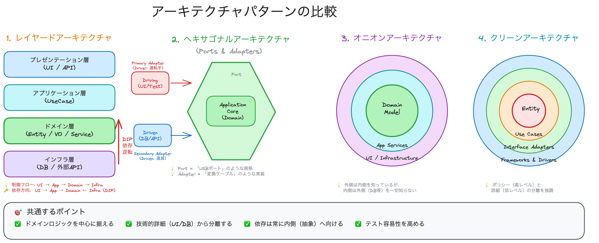

# アーキテクチャパターンの比較

DDD（ドメイン駆動設計）の実践において、ドメインモデルを中心据え、技術的な詳細から隔離するために様々なアーキテクチャパターンが利用されます。
ここでは代表的な4つのアーキテクチャについて解説し、それらの共通点と違いを明らかにします。

## 目次

1. [レイヤードアーキテクチャ (Layered Architecture)](#1-レイヤードアーキテクチャ-layered-architecture)
2. [ヘキサゴナルアーキテクチャ (Hexagonal Architecture)](#2-ヘキサゴナルアーキテクチャ-hexagonal-architecture)
3. [オニオンアーキテクチャ (Onion Architecture)](#3-オニオンアーキテクチャ-onion-architecture)
4. [クリーンアーキテクチャ (Clean Architecture)](#4-クリーンアーキテクチャ-clean-architecture)
5. [比較とまとめ](#5-比較とまとめ)

---

> 📎 **図解**: [Excalidrawで見る](../other/13_architectural_patterns/architectures.excalidraw)



---

## 1. レイヤードアーキテクチャ (Layered Architecture)

最も古くからある伝統的なパターンですが、DDDにおいては「依存関係逆転の原則 (DIP)」を適用した形が一般的です。

### 構造

伝統的には以下の4層で構成されますが、DIP適用後は依存の方向が重要になります。

| 層 | 責務 | 例 |
|---|---|---|
| **プレゼンテーション層** | ユーザーとのやり取り | Controller, View, API Endpoint |
| **アプリケーション層** | ユースケースの調整役 | ApplicationService, Command Handler |
| **ドメイン層** | ビジネスロジック | Entity, Value Object, Domain Service |
| **インフラストラクチャ層** | 技術的詳細 | Repository実装, ORM, メール送信 |

### 依存の方向 (DIP適用後)

```
┌─────────────────────────────────────────────────────────────┐
│                     Presentation Layer                       │
│    (Controller が ApplicationService を呼び出す)              │
└────────────────────────────┬────────────────────────────────┘
                             ↓
┌─────────────────────────────────────────────────────────────┐
│                     Application Layer                        │
│    (IRepository インターフェースを使う)                        │
└────────────────────────────┬────────────────────────────────┘
                             ↓
┌─────────────────────────────────────────────────────────────┐
│                       Domain Layer                           │
│    (IRepository インターフェースを定義)                        │
└────────────────────────────↑────────────────────────────────┘
                             │  DIP (依存関係逆転)
┌────────────────────────────┴────────────────────────────────┐
│                   Infrastructure Layer                       │
│    (IRepository を実装)                                       │
└─────────────────────────────────────────────────────────────┘
```

### コード例

```typescript
// ドメイン層: インターフェース定義
interface IOrderRepository {
  findById(id: OrderId): Promise<Order | null>;
  save(order: Order): Promise<void>;
}

// アプリケーション層: ユースケース
class PlaceOrderUseCase {
  constructor(private orderRepository: IOrderRepository) {}
  
  async execute(command: PlaceOrderCommand): Promise<void> {
    const order = Order.create(command.customerId, command.items);
    await this.orderRepository.save(order);
  }
}

// インフラ層: リポジトリ実装
class PostgresOrderRepository implements IOrderRepository {
  async save(order: Order): Promise<void> {
    // PostgreSQL固有の実装
  }
}
```

### メリット・デメリット

| メリット | デメリット |
|---------|-----------|
| シンプルで理解しやすい | 層間の境界が曖昧になりがち |
| 広く普及している | 「上から下」への依存に陥りやすい |
| フレームワークとの親和性が高い | インフラ層への依存が発生しやすい |

### よくある間違い

| ❌ アンチパターン | ✅ 推奨パターン |
|------------------|----------------|
| ドメイン層がDBに直接アクセス | Repository経由でアクセス |
| Controller内にビジネスロジック | Domain/Applicationに移動 |
| ドメインオブジェクトをそのままAPI返却 | DTOに変換して返却 |

---

## 2. ヘキサゴナルアーキテクチャ (Hexagonal Architecture)

別名「ポートアンドアダプター (Ports and Adapters)」とも呼ばれます。アプリケーションを「内側」と「外側」に明確に分け、その境界を「ポート」と「アダプター」で繋ぐという考え方です。

> 💡 **なぜ六角形なのか？**
> Alistair Cockburn が提唱した際、「多くのポートを持つ」ことを視覚的に表現するために六角形を使用しました。実際には辺の数に意味はなく、4つでも8つでも構いません。

### 構造

| コンポーネント | 説明 | 例 |
|---------------|------|---|
| **アプリケーションコア** | ビジネスロジック（ドメイン + ユースケース） | Entity, UseCase |
| **入力ポート (Driving Port)** | 外部からコアを呼び出すためのインターフェース | `IPlaceOrderUseCase` |
| **出力ポート (Driven Port)** | コアが外部を呼び出すためのインターフェース | `IOrderRepository` |
| **入力アダプター (Driving Adapter)** | 入力ポートを呼び出す実装 | REST Controller, CLI |
| **出力アダプター (Driven Adapter)** | 出力ポートを実装 | MySQLRepository |

### Driving と Driven の違い

```
┌─────────────────────────────────────────────────────────────────┐
│                                                                  │
│    [Driving Adapter]            [Driven Adapter]                │
│        ↓                              ↑                         │
│   ┌─────────┐                    ┌─────────┐                    │
│   │   UI    │ ──→ Port ──→ │  Core  │ ──→ Port ──→ │   DB    │  │
│   │  Test   │              │        │              │  API   │   │
│   │   CLI   │              │        │              │  MQ    │   │
│   └─────────┘              └────────┘              └────────┘   │
│                                                                  │
│   「コアを駆動する」        「コアに駆動される」                    │
│                                                                  │
└─────────────────────────────────────────────────────────────────┘
```

- **Driving (Primary)**: アプリケーションを「呼び出す側」。ユーザー操作、テスト、バッチ処理など。
- **Driven (Secondary)**: アプリケーションに「呼び出される側」。DB、外部API、メッセージキューなど。

### コード例

```typescript
// === ポート（インターフェース）===

// 入力ポート (Driving Port) - コアが公開するもの
interface IPlaceOrderUseCase {
  execute(command: PlaceOrderCommand): Promise<OrderId>;
}

// 出力ポート (Driven Port) - コアが依存するもの
interface IOrderRepository {
  save(order: Order): Promise<void>;
}
interface IPaymentGateway {
  charge(amount: Money, customerId: CustomerId): Promise<PaymentResult>;
}

// === アプリケーションコア ===
class PlaceOrderUseCase implements IPlaceOrderUseCase {
  constructor(
    private orderRepository: IOrderRepository,
    private paymentGateway: IPaymentGateway
  ) {}

  async execute(command: PlaceOrderCommand): Promise<OrderId> {
    const order = Order.create(command);
    await this.paymentGateway.charge(order.totalAmount, command.customerId);
    await this.orderRepository.save(order);
    return order.id;
  }
}

// === アダプター ===

// 入力アダプター (Driving Adapter)
class OrderController {
  constructor(private placeOrderUseCase: IPlaceOrderUseCase) {}
  
  async post(req: Request): Promise<Response> {
    const orderId = await this.placeOrderUseCase.execute(req.body);
    return Response.created({ orderId });
  }
}

// 出力アダプター (Driven Adapter)
class StripePaymentGateway implements IPaymentGateway {
  async charge(amount: Money, customerId: CustomerId): Promise<PaymentResult> {
    // Stripe APIを呼び出す
  }
}
```

### メリット

| メリット | 説明 |
|---------|------|
| **対称性** | UI も DB も等しく「外部」として扱う |
| **テスト容易性** | アダプターをモックに差し替え可能 |
| **技術選択の自由** | アダプターを変えるだけでDBやUIを変更可能 |
| **ビジネスロジックの純粋性** | コアはフレームワークに依存しない |

---

## 3. オニオンアーキテクチャ (Onion Architecture)

ヘキサゴナルアーキテクチャをさらに洗練させ、同心円状の層構造で依存関係の方向を厳密に定義したものです。Jeffrey Palermo によって2008年に提唱されました。

### 構造

```
            ┌─────────────────────────────────────────┐
            │         Infrastructure / UI             │
            │  ┌──────────────────────────────────┐  │
            │  │      Application Services        │  │
            │  │  ┌───────────────────────────┐   │  │
            │  │  │     Domain Services       │   │  │
            │  │  │  ┌────────────────────┐   │   │  │
            │  │  │  │   Domain Model     │   │   │  │
            │  │  │  │ (Entity / VO)      │   │   │  │
            │  │  │  └────────────────────┘   │   │  │
            │  │  └───────────────────────────┘   │  │
            │  └──────────────────────────────────┘  │
            └─────────────────────────────────────────┘
                          依存は常に内側へ →
```

| 層 | 責務 | 例 |
|---|------|---|
| **Domain Model** | エンティティ・値オブジェクト | `Order`, `Money`, `Email` |
| **Domain Services** | 複数エンティティを跨ぐロジック | `PricingService`, `OrderValidator` |
| **Application Services** | ユースケース・オーケストレーション | `PlaceOrderUseCase` |
| **Infrastructure/UI** | 技術的詳細・外部接点 | Controller, Repository実装, ORM |

### 依存のルール

> ⚠️ **The Dependency Rule**  
> 外側の層は内側の層に依存できるが、内側の層は外側の層のことを一切知らない。

```typescript
// ✅ OK: Application層 → Domain層
class PlaceOrderUseCase {
  constructor(private order: Order) {} // OrderはDomain層
}

// ❌ NG: Domain層 → Infrastructure層
class Order {
  constructor(private dbConnection: Database) {} // 絶対ダメ！
}
```

### レイヤードアーキテクチャとの違い

| 観点 | レイヤード | オニオン |
|------|-----------|---------|
| 依存の方向 | 上→下 | 外→内 |
| インフラ層の位置 | 最下層 | 最外層 |
| ドメインの扱い | 中間層の一つ | 最中心（最重要） |

---

## 4. クリーンアーキテクチャ (Clean Architecture)

これまでのアーキテクチャパターンの集大成として、Robert C. Martin (Uncle Bob) によって2012年に提唱されました。概念的にはオニオンアーキテクチャと非常に似ています。

### 構造

```
        ┌──────────────────────────────────────────────────┐
        │             Frameworks & Drivers (青)            │
        │    ┌──────────────────────────────────────┐     │
        │    │       Interface Adapters (緑)        │     │
        │    │   ┌──────────────────────────────┐   │     │
        │    │   │        Use Cases (赤)        │   │     │
        │    │   │   ┌──────────────────────┐   │   │     │
        │    │   │   │    Entities (黄)     │   │   │     │
        │    │   │   └──────────────────────┘   │   │     │
        │    │   └──────────────────────────────┘   │     │
        │    └──────────────────────────────────────┘     │
        └──────────────────────────────────────────────────┘
```

| 層 | 責務 | DDDとの対応 |
|---|------|------------|
| **Entities** | 企業全体のビジネスルール | Domain Model |
| **Use Cases** | アプリケーション固有のビジネスルール | Application Service |
| **Interface Adapters** | データ変換・形式変換 | Controller, Presenter, Gateway |
| **Frameworks & Drivers** | 技術的詳細 | Web Framework, ORM, DB |

### 依存関係のルール (The Dependency Rule)

> 💡 **Uncle Bobの言葉**  
> 「ソースコードの依存性は、常に内側（高レベルな方針）に向かわなければならない」

### Input/Output Boundary パターン

クリーンアーキテクチャの特徴的な概念として、**Boundary（境界）** があります。

```typescript
// Input Boundary (Use Case Input Port)
interface IPlaceOrderInputBoundary {
  execute(request: PlaceOrderRequest): void;
}

// Output Boundary (Use Case Output Port)
interface IPlaceOrderOutputBoundary {
  present(response: PlaceOrderResponse): void;
}

// Use Case実装
class PlaceOrderInteractor implements IPlaceOrderInputBoundary {
  constructor(
    private orderRepository: IOrderRepository,
    private presenter: IPlaceOrderOutputBoundary
  ) {}

  execute(request: PlaceOrderRequest): void {
    const order = Order.create(request);
    this.orderRepository.save(order);
    this.presenter.present(new PlaceOrderResponse(order.id));
  }
}

// Presenter (Interface Adapter層)
class PlaceOrderPresenter implements IPlaceOrderOutputBoundary {
  present(response: PlaceOrderResponse): void {
    // ViewModelに変換してUIに渡す
  }
}
```

### オニオンアーキテクチャとの違い

| 観点 | オニオン | クリーン |
|------|---------|---------|
| 提唱者 | Jeffrey Palermo | Robert C. Martin |
| Presenterの位置 | 明確でない | Interface Adapters層として明確 |
| Interactor | Application Services | Use Casesとして強調 |
| 実質的な違い | ほぼ同じ概念で、表現が異なるだけ |

---

## 5. 比較とまとめ

これら4つのアーキテクチャは、表現方法は異なりますが、**目指しているゴールは同じ**です。

### 共通する目的

1.  **関心事の分離**: ビジネスロジックと技術的詳細（UI, DB, Framework）を切り離す。
2.  **テスト容易性**: ビジネスロジックを単体でテスト可能にする。
3.  **独立性**: UIやDB、フレームワークを変更しても、ビジネスロジックに影響を与えない。

### 用語の対応表

| 概念 | レイヤード | ヘキサゴナル | オニオン | クリーン |
| :--- | :--- | :--- | :--- | :--- |
| **ビジネスの中心** | ドメイン層 | Inside (App Core) | Domain Model | Entities |
| **ユースケース** | アプリケーション層 | Inside (App Core) | Application Services | Use Cases |
| **技術的詳細** | インフラ層 / UI層 | Outside (Adapter) | Infrastructure / UI | Frameworks & Drivers |
| **境界の定義** | インターフェース (DIP) | Port | Interface | Input/Output Boundary |

### どれを採用すべきか？

DDDを実践する場合、**オニオンアーキテクチャ** または **クリーンアーキテクチャ** の考え方をベースにするのが一般的です。
特に「依存の方向を内側に向ける」というルールさえ守れていれば、層の厳密な名前よりも、**ドメインモデルを守ること**が最重要です。
